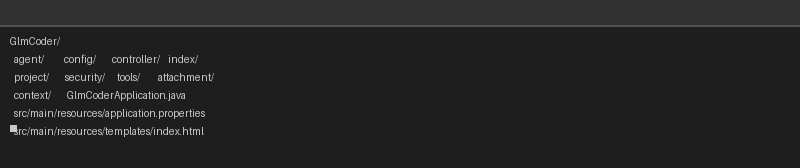
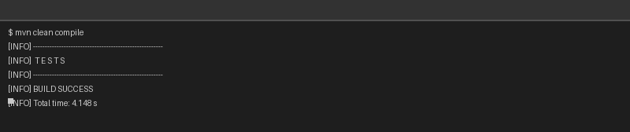
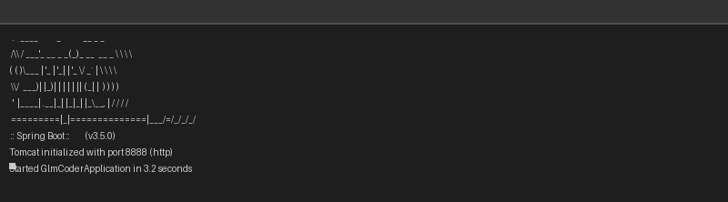
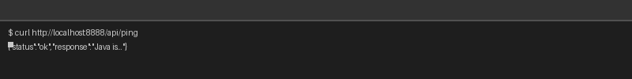
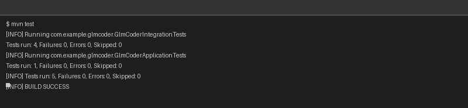

# GlmCoder 本地搭建指南

> 基于 Spring AI + GLM-4-Flash 的 Java 智能编码助手

---

## 目录

1. [项目是什么](#1-项目是什么)
2. [你需要准备什么](#2-你需要准备什么)
3. [第一步：安装 Java 17 和 Maven](#3-第一步安装-java-17-和-maven)
4. [第二步：获取代码](#4-第二步获取代码)
5. [第三步：配置 API Key](#5-第三步配置-api-key)
6. [第四步：编译项目](#6-第四步编译项目)
7. [第五步：启动服务](#7-第五步启动服务)
8. [第六步：打开网页验证](#8-第六步打开网页验证)
9. [关键配置详解](#9-关键配置详解)
10. [架构速览](#10-架构速览)
11. [调试命令大全](#11-调试命令大全)
12. [踩坑记录与解决方案](#12-踩坑记录与解决方案)
13. [常见问题 FAQ](#13-常见问题-faq)
14. [命令速查表](#14-命令速查表)

---

## 1. 项目是什么

**GlmCoder** 是一个 AI 编码助手。你在网页上输入"帮我重构 UserService"，它会：

1. 自动搜索项目中相关代码
2. 分析代码结构（类、方法、依赖关系）
3. 制定修改方案
4. 帮你改代码
5. 自动运行 `mvn compile` 检查编译是否通过
6. 如果编译失败，自动分析错误并重试修复（最多 3 次）

**技术栈：**

| 组件 | 版本 | 作用 |
|------|------|------|
| Java | 17 | 编程语言 |
| Spring Boot | 3.5.0 | Web 框架 |
| Spring AI | 1.0.0-M6 | 连接大模型 |
| GLM-4-Flash | - | 智谱 AI 的大语言模型 |
| Maven | 3.8+ | 构建工具 |
| JavaParser | 3.26.3 | AST 代码解析 |
| Thymeleaf | - | 网页模板 |

**运行端口：** `8888`

---

## 2. 你需要准备什么

- 一台有网络连接的电脑（Linux / Mac / Windows 都可以）
- JDK 17（Java 开发工具包）
- Maven 3.8+
- Git
- 一个**智谱 AI 的 API Key**（用于调用 GLM 大模型）
- 至少 2GB 可用内存

---

## 3. 第一步：安装 Java 17 和 Maven

### 3.1 安装 JDK 17

**Ubuntu / Debian：**

```bash
# 更新软件包列表
sudo apt update

# 安装 JDK 17
sudo apt install -y openjdk-17-jdk

# 验证安装
java -version
```

**看到类似下面的输出就是装好了：**
```
openjdk version "17.0.xx" ...
```

**CentOS / Rocky Linux：**

```bash
sudo yum install -y java-17-openjdk java-17-openjdk-devel
java -version
```

**macOS：**

```bash
brew install openjdk@17
```

**Windows：**

去 Oracle 官网下载 JDK 17 安装包：
`https://www.oracle.com/java/technologies/downloads/#java17`

下载 `.msi` 安装包，双击安装，一路点"下一步"即可。

---

### 3.2 安装 Maven

**Ubuntu / Debian：**

```bash
sudo apt install -y maven
mvn -version
```

**看到类似下面的输出就是装好了：**
```
Apache Maven 3.8.x
Java version: 17.0.x
```

**手动安装（如果 apt 版本太旧）：**

```bash
# 下载 Maven
cd /tmp
wget https://dlcdn.apache.org/maven/maven-3/3.9.9/binaries/apache-maven-3.9.9-bin.tar.gz

# 解压到 /opt
sudo tar -xzf apache-maven-3.9.9-bin.tar.gz -C /opt
sudo ln -s /opt/apache-maven-3.9.9 /opt/maven

# 配置环境变量
echo 'export M2_HOME=/opt/maven' >> ~/.bashrc
echo 'export PATH=$M2_HOME/bin:$PATH' >> ~/.bashrc
source ~/.bashrc

# 验证
mvn -version
```

---

## 4. 第二步：获取代码

```bash
# 克隆项目到本地
cd ~
git clone https://github.com/liliangxing/GlmCoder.git
cd GlmCoder
```

> **说明：** `git clone` 会把 GitHub 上的代码下载到你当前目录下。如果下载很慢，可以在命令前面加 `GIT_SSL_NO_VERIFY=1` 跳过 SSL 校验。

项目结构一览：



---

## 5. 第三步：配置 API Key

### 5.1 获取智谱 AI 的 API Key

1. 打开浏览器访问：`https://open.bigmodel.cn/`
2. 注册/登录账号
3. 进入"API 密钥"页面，创建一个新的 API Key
4. 复制这个 Key，格式类似于：`xxxxxxxxxxxxxxxxxxxxxxxxxxxxxxxx.xxxxxxxxx`

> **重要：** API Key 是收费的，请保管好不要泄露。智谱新用户一般有免费额度。

### 5.2 配置方式（二选一）

**方式一：环境变量（[推荐]，更安全）**

```bash
# 在当前终端临时设置（关闭终端就失效）
export GLM_API_KEY=你的API密钥

# 永久设置（写入配置文件）
echo 'export GLM_API_KEY=你的API密钥' >> ~/.bashrc
source ~/.bashrc
```

**方式二：直接写在配置文件里（简单但不安全）**

打开文件 `src/main/resources/application.properties`，找到这一行：

```properties
spring.ai.openai.api-key=${GLM_API_KEY:15085dae9c11401da6662b88c91d2f4c.AiOP4uJyhV8WaMzA}
```

把冒号后面的默认 key 替换成你自己的：

```properties
spring.ai.openai.api-key=${GLM_API_KEY:你的API密钥}
```

> **语法解释：** `${GLM_API_KEY:默认值}` 的意思是：先去环境变量 `GLM_API_KEY` 里找，如果没找到，就用冒号后面的默认值。

---

## 6. 第四步：编译项目

```bash
# 进入项目目录
cd ~/GlmCoder

# 编译（第一次会下载依赖，需要几分钟）
mvn clean compile
```

**如果看到以下输出，说明编译成功：**



```
[INFO] BUILD SUCCESS
[INFO] Total time: xx.xxx s
```

> **说明：** `mvn clean compile` 中：
> - `clean` — 先删除之前编译生成的文件（清理战场）
> - `compile` — 编译所有 Java 源代码
> - 第一次运行会自动从网络下载依赖包（Spring Boot、Spring AI、JavaParser 等），存在 `~/.m2/repository/` 目录下

---

## 7. 第五步：启动服务

### 7.1 直接启动

```bash
# 在项目目录下执行
mvn spring-boot:run
```

**看到以下输出说明启动成功：**



```
o.s.b.w.embedded.tomcat.TomcatWebServer  : Tomcat started on port 8888
c.e.glmcoder.GlmCoderApplication         : Started GlmCoderApplication
```

按 `Ctrl+C` 可以停止服务。

---

### 7.2 后台启动（推荐，关闭终端也不会停）

```bash
# 后台启动，输出写到日志文件
nohup mvn spring-boot:run > glmcoder.log 2>&1 &

# 查看日志
tail -f glmcoder.log
```

> **说明：**
> - `nohup` — 让程序忽略终端关闭信号（关掉终端也不会停）
> - `> glmcoder.log 2>&1` — 把所有输出都写入 `glmcoder.log` 文件
> - 最后的 `&` — 让程序在后台运行
> - `tail -f` — 实时查看日志文件末尾（按 `Ctrl+C` 退出查看）

---

### 7.3 如何检查服务是否在运行

```bash
# 方法1：查端口是否被占用
lsof -i :8888

# 方法2：查 Java 进程
ps aux | grep glmcoder

# 方法3：直接访问健康检查
curl http://localhost:8888/api/ping
```

---

### 7.4 如何停止服务

```bash
# 找到 glmcoder 的进程 ID
ps aux | grep glmcoder

# 记下进程 ID（第二列的数字），然后：
kill 进程ID
```

---

## 8. 第六步：打开网页验证

### 8.1 浏览器访问

打开浏览器，输入地址：

```
http://localhost:8888/ui
```

你应该能看到 GlmCoder 的主页面：左边是代码结构区，右边是聊天对话区。

### 8.2 快速验证 AI 是否正常

```bash
# 测试 AI API 是否可用（不需要打开网页）
curl http://localhost:8888/api/ping
```



**如果返回类似以下内容，说明 AI 连接正常：**
```json
{"status":"ok","response":"Java 是一种..."}
```

### 8.3 使用网页

1. 在顶部输入框项目路径：`/root/GlmCoder`（或你自己的项目路径）
2. 点击 **"打开项目"**
3. 点击红色 **"索引"** 按钮（扫描项目代码结构）
4. 在底部输入框输入编码任务，例如：
   - `添加一个注释` — 简单的测试任务
   - `重构 UserService 中的重复代码` — 实际的编码任务
5. 点击 **"发送"**，等待 Agent 自动分析和修改代码

---

## 9. 关键配置详解

### 9.1 核心配置文件

文件位置：`src/main/resources/application.properties`

```properties
# 应用名（不用改）
spring.application.name=glmcoder

# 服务端口（如果 8888 被占用，改成别的比如 9999）
server.port=8888

# ===== 大模型 API 配置 =====
# API Key（通过环境变量 GLM_API_KEY 传入）
spring.ai.openai.api-key=${GLM_API_KEY:默认值}

# 智谱 AI 的 API 地址（不用改）
spring.ai.openai.base-url=https://open.bigmodel.cn/api/paas

# API 路径（不用改）
spring.ai.openai.chat.completions-path=/v4/chat/completions

# 使用 GLM-4-Flash 模型（免费/便宜）
spring.ai.openai.chat.options.model=glm-4-flash

# 温度 0.1（低随机性，适合代码生成，输出更稳定）
spring.ai.openai.chat.options.temperature=0.1

# ===== 文件上传 =====
spring.servlet.multipart.max-file-size=16MB
spring.servlet.multipart.max-request-size=16MB

# ===== 工作区配置 =====
# 上传的文件会存在这里
glmcoder.workspace=${user.home}/glmcoder-workspace

# 编译失败最多自动重试几次
glmcoder.max-retries=3

# 最多索引多少文件
glmcoder.index.max-files=10000
```

> **为什么 temperature 设 0.1？**
> Temperature 控制输出的"创造性"。0 最确定（每次给出相同答案），1 最随机。
> 写代码需要准确、稳定，所以用低值 0.1。

---

### 9.2 System Prompt（给 AI 的系统指令）

文件位置：`src/main/java/com/example/glmcoder/config/AgentConfig.java`

这段是告诉 AI 它是谁、该怎么做：

```java
public static final String SYSTEM_PROMPT = """
    你是 GlmCoder，一个专业的 Java 代码重构助手，基于 GLM-4.7-Flash。

    ## 安全规则
    1. 严禁删除文件或重命名核心配置文件（如 pom.xml, application.yml）。
    2. 修改代码前，必须先调用工具阅读相关文件和依赖关系。
    3. 生成的 Patch 必须通过编译检查。
    4. 所有文件路径必须位于项目目录内，禁止访问项目外文件。
    ...
    """;
```

> **为什么需要 System Prompt？** 大模型本身不知道自己是"编码助手"。这个 prompt 告诉它角色定位、工作流程和安全边界。

---

### 9.3 API 地址的坑（重要！）

Spring AI 默认会把请求发到 `https://xxx/v1/chat/completions`。

但智谱 AI 的 API 路径是 `/v4/chat/completions`。

**配置文件的解决方式：**

```properties
spring.ai.openai.base-url=https://open.bigmodel.cn/api/paas
spring.ai.openai.chat.completions-path=/v4/chat/completions
```

这样最终请求地址是：`https://open.bigmodel.cn/api/paas/v4/chat/completions`

> 如果配错路径，会报 404 错误。这是最容易踩的坑。

---

## 10. 架构速览

```
GlmCoder 项目结构
├── agent/                    # Agent 引擎（大脑）
│   ├── CodingAgent           # 主编码 Agent
│   └── ReflectionAgent       # 编译检查 + 自动修复循环
│
├── index/                    # 代码索引（眼睛）
│   ├── CodeStructureIndex    # AST 解析，提取类/方法/字段
│   ├── CallGraphBuilder      # 方法调用关系图
│   ├── IndexService          # 索引服务入口
│   └── IncrementalIndex      # 监听文件变化（v4 新增）
│
├── tools/                    # 工具箱（手）
│   ├── CodeUnderstandingTools # 搜索代码、读文件
│   ├── FileTools             # 列出文件、搜索文件
│   ├── ModificationTools     # 编辑文件、创建文件、生成 Diff
│   ├── BuildTools            # mvn compile 编译检查、运行测试
│   ├── DependencyAnalysisTools # 依赖分析
│   └── GitManager            # Git 备份/回滚/提交（v4 新增）
│
├── security/                 # 安全沙箱
│   ├── PathValidator         # 路径白名单，禁止访问项目外文件
│   └── PatchApprovalService  # Patch 审批机制
│
├── context/                  # 上下文管理
│   └── ContextCompressor     # Token 压缩（防止超长）
│
├── attachment/               # 附件管理
│   ├── AttachmentManager     # 文件上传存储
│   └── AttachmentSummaryService # 文件摘要（v4 新增）
│
├── project/
│   └── ProjectManager        # 多项目管理
│
├── config/                   # 配置
│   ├── AgentConfig           # System Prompt + ChatClient 配置
│   └── AppProperties         # 应用参数
│
└── controller/               # HTTP 接口
    ├── AgentController       # /api/* REST API
    └── ProjectController     # /ui 页面路由
```

**Agent 工作流程：**

```
用户输入"修改 UserService"
    │
    ├── 1. 索引项目（扫描所有 Java 文件）
    ├── 2. 压缩上下文（防止 Token 超限）
    ├── 3. AI 分析需求，调用工具搜索代码
    ├── 4. AI 生成修改方案，调用 editFile 修改
    ├── 5. 调用 mvn compile 验证编译
    ├── 6. 编译失败 → 读取错误日志 → 重新修复（最多 3 次）
    └── 7. 返回结果
```

---

## 11. 调试命令大全

这些命令在排查问题时非常有用。

### 11.1 Java 环境检查

```bash
# 查看 Java 版本
java -version

# 查看 JAVA_HOME 环境变量
echo $JAVA_HOME

# 如果没有设置，手动设置
export JAVA_HOME=/usr/lib/jvm/java-17-openjdk-amd64
```

### 11.2 Maven 相关

```bash
# 运行所有测试
mvn test
```



```bash
# 查看 Maven 版本
mvn -version

# 清理编译缓存
mvn clean

# 编译（不运行测试）
mvn compile

# 编译 + 打包
mvn package -DskipTests

# 运行所有测试
mvn test

# 运行指定测试类
mvn test -Dtest=GlmCoderApplicationTests

# 查看依赖树（排查依赖冲突）
mvn dependency:tree

# 强制重新下载依赖
mvn clean compile -U
```

> **说明：** `-U` 参数强制 Maven 检查远程仓库是否有更新版本，而不使用本地缓存。

### 11.3 服务运行与停止

```bash
# 启动服务
mvn spring-boot:run

# 后台启动（日志写入文件）
nohup mvn spring-boot:run > glmcoder.log 2>&1 &

# 查看日志
tail -f glmcoder.log

# 查找 glmcoder 进程
ps aux | grep glmcoder

# 按端口查找进程
lsof -i :8888
# 或
netstat -tlnp | grep 8888

# 停止服务（记下进程 ID 后 kill）
kill 进程ID

# 强制停止
kill -9 进程ID
```

### 11.4 端口被占用怎么办

```bash
# 查看端口 8888 被谁占用
lsof -i :8888

# 停掉占用进程
kill $(lsof -t -i:8888)

# 或者换个端口启动
# 在 application.properties 里把 server.port=8888 改成 server.port=9999
mvn spring-boot:run -Dspring-boot.run.arguments="--server.port=9999"
```

### 11.5 API 测试

```bash
# 测试服务是否在运行 + AI 是否连通
curl http://localhost:8888/api/ping

# 非流式对话
curl -X POST http://localhost:8888/api/chat \
  -d "projectId=abc123&message=你好" \
  -H "Content-Type: application/x-www-form-urlencoded"

# 查看代码结构
curl "http://localhost:8888/api/structure?projectId=abc123"

# 查看待审批 Patch 列表
curl http://localhost:8888/api/patches
```

### 11.6 Git 相关

```bash
# 查看最近的提交
git log --oneline -10

# 查看当前有哪些文件改动了
git status

# 查看具体改了什么
git diff

# 丢弃所有本地改动（回到上一个提交的状态）
git checkout .

# 切回某个旧版本
git checkout <commit-hash>
```

### 11.7 查看编译错误详情

```bash
# 在项目目录下直接运行 Maven 编译（看全部输出，不过滤）
mvn compile

# 只看错误行
mvn compile 2>&1 | grep -i error
```

---

## 12. 踩坑记录与解决方案

### 坑 1：API 地址 404 错误

**现象：** 启动后调用 API 返回 404

**原因：** Spring AI 默认拼接 `/v1/chat/completions`，但智谱 API 用的是 `/v4/chat/completions`

**解决：**

在 `application.properties` 里加了这两行：

```properties
spring.ai.openai.chat.completions-path=/v4/chat/completions
```

**为什么？** 智谱 API 的 v4 端点地址是 `/api/paas/v4/chat/completions`。Spring AI 默认会把 `base-url` + 内置路径拼接为 `/api/paas/v1/chat/completions`（v1 不存在），所以要显式指定 `completions-path=/v4/chat/completions`。

---

### 坑 2：JavaParser 不支持 Java 17 语法

**现象：** 解析新版本 Java 语法时报错（如 `switch` 表达式、`sealed class`、`text blocks`）

**原因：** JavaParser 默认解析 Java 8 语法，遇到新版语法报错

**解决：**

创建 JavaParser 实例时指定 Java 17 语言级别：

```java
ParserConfiguration config = new ParserConfiguration();
config.setLanguageLevel(ParserConfiguration.LanguageLevel.JAVA_17);
this.javaParser = new JavaParser(config);
```

> **为什么不用全局 static 实例？** 如果用全局 static 的 JavaParser，配置可能不生效。每次用 `new JavaParser(config)` 确保配置被正确应用。

---

### 坑 3：前端 fetch 错误没有正确处理

**现象：** 网页调用 API 失败时只显示 "处理中..."，没有错误提示

**原因：** 前端 JavaScript 的 `fetch()` 没有 `catch` 错误处理

**解决：** 给 fetch 加上 `try-catch`，在 catch 里显示错误消息：

```javascript
try {
    const res = await fetch('/api/chat', {
        method: 'POST',
        headers: { 'Content-Type': 'application/x-www-form-urlencoded' },
        body: formData.toString()
    });
    const data = await res.json();
    if (data.status === 'ok') {
        addMessage('agent', data.response);
    } else {
        addMessage('system', '错误: ' + data.message);
    }
} catch (e) {
    addMessage('system', '连接失败: ' + e.message);
}
```

---

### 坑 4：流式输出没有实时显示

**现象：** 虽然后端有 SSE 流式接口，但前端用的是非流式的 `fetch('/api/chat')`

**解决（v4 优化）：** 前端改用 `EventSource` 连接 SSE 流式接口：

```javascript
const eventSource = new EventSource('/api/chat/stream?...');

eventSource.addEventListener('token', function(e) {
    // 每收到一个 token 就追加到页面
    textBuffer += e.data;
    agentMsg.textContent = textBuffer;
});

eventSource.addEventListener('status', function(e) {
    if (e.data === 'done') {
        eventSource.close();
    }
});
```

---

### 坑 5：Windows 下 Maven 编译乱码

**现象：** Windows 的 cmd/PowerShell 里编译输出中文乱码

**解决：**

```bash
# 在 PowerShell 里先执行
chcp 65001

# 或者设置环境变量
set MAVEN_OPTS=-Dfile.encoding=UTF-8
```

---

## 13. 常见问题 FAQ

### Q：启动后报 "Address already in use"

**A：** 端口 8888 被其他程序占用了。

```bash
# 杀掉占用端口的进程
kill $(lsof -t -i:8888)

# 或换端口启动
mvn spring-boot:run -Dspring-boot.run.arguments="--server.port=9999"
```

---

### Q：编译时下载依赖特别慢 / 超时

**A：** Maven 默认从国外中央仓库下载，需要配置国内镜像。

在 `~/.m2/settings.xml` 写入（如果没有这个文件就新建）：

```xml
<settings>
  <mirrors>
    <mirror>
      <id>aliyun</id>
      <name>Aliyun Maven Mirror</name>
      <url>https://maven.aliyun.com/repository/public</url>
      <mirrorOf>central</mirrorOf>
    </mirror>
  </mirrors>
</settings>
```

---

### Q：网页打开了但是点发送没反应

**A：** 先确认：
1. 服务确实在运行：`curl http://localhost:8888/api/ping`
2. 项目已打开并已索引（点击红色"索引"按钮）
3. 打开浏览器 F12 开发者工具 → Console，看有没有红色报错

---

### Q：AI 返回 "Agent 执行失败"

**A：** 可能原因：
1. API Key 不对或过期 → 检查环境变量 `echo $GLM_API_KEY`
2. API 余额不足 → 去智谱控制台查看额度
3. 网络不通 → `curl https://open.bigmodel.cn/api/paas/v4/chat/completions` 测试

---

### Q：我想换个 AI 模型，比如用 GPT-4

**A：** 修改 `application.properties`：

```properties
# 智谱 GLM-4-Flash（免费/便宜）
spring.ai.openai.chat.options.model=glm-4-flash

# 如果想用更大的 GLM-4（更贵但效果更好）
spring.ai.openai.chat.options.model=glm-4

# 如果用 OpenAI GPT-4，需要改 base-url
spring.ai.openai.base-url=https://api.openai.com
spring.ai.openai.chat.completions-path=/v1/chat/completions
spring.ai.openai.chat.options.model=gpt-4
```

---

## 14. 命令速查表

```
=========================================================
命令                    作用              在哪执行
=========================================================
java -version           查看 Java 版本     任意目录
mvn -version            查看 Maven 版本    任意目录
mvn clean compile       编译项目           项目根目录
mvn spring-boot:run    启动服务           项目根目录
mvn test                运行测试           项目根目录
mvn test -Dtest=XxxTest 运行单个测试       项目根目录
mvn dependency:tree     查看依赖树         项目根目录
mvn clean compile -U    强制重新编译       项目根目录
---------------------------------------------------------
curl localhost:8888/api/ping    测试 AI 连通性
curl localhost:8888/api/structure?projectId=xxx   查看代码结构
curl localhost:8888/api/patches  查看待审批 Patch
---------------------------------------------------------
ps aux | grep glmcoder         查找运行中的进程
kill <PID>                      停止服务
lsof -i :8888                   查看端口占用
tail -f glmcoder.log            查看实时日志
---------------------------------------------------------
git status                      查看文件变动
git diff                        查看具体改动
git log --oneline -10           查看提交历史
git checkout .                  丢弃所有改动
=========================================================
```

---

## 附录：文件清单

```
GlmCoder/
├── .gitignore
├── .git/
├── ARCHITECTURE.md            # 架构文档
├── pom.xml                     # Maven 构建配置
├── src/
│   ├── main/
│   │   ├── java/com/example/glmcoder/
│   │   │   ├── GlmCoderApplication.java    # 启动类
│   │   │   ├── agent/
│   │   │   │   ├── CodingAgent.java        # 主 Agent
│   │   │   │   └── ReflectionAgent.java     # 编译检查 + 修复
│   │   │   ├── attachment/
│   │   │   │   ├── AttachmentManager.java   # 附件存储
│   │   │   │   └── AttachmentSummaryService.java  # 附件摘要
│   │   │   ├── config/
│   │   │   │   ├── AgentConfig.java         # System Prompt
│   │   │   │   └── AppProperties.java       # 应用参数
│   │   │   ├── context/
│   │   │   │   └── ContextCompressor.java   # Token 压缩
│   │   │   ├── controller/
│   │   │   │   ├── AgentController.java     # /api REST API
│   │   │   │   └── ProjectController.java   # /ui 页面路由
│   │   │   ├── index/
│   │   │   │   ├── CallGraphBuilder.java    # 调用图
│   │   │   │   ├── CodeStructureIndex.java  # AST 索引
│   │   │   │   ├── IncrementalIndex.java    # 增量索引
│   │   │   │   └── IndexService.java        # 索引服务
│   │   │   ├── project/
│   │   │   │   └── ProjectManager.java      # 项目管理
│   │   │   ├── security/
│   │   │   │   ├── PathValidator.java       # 路径安全
│   │   │   │   └── PatchApprovalService.java # Patch 审批
│   │   │   └── tools/
│   │   │       ├── BuildTools.java          # 编译 + 测试
│   │   │       ├── CodeUnderstandingTools.java # 代码搜索
│   │   │       ├── DependencyAnalysisTools.java # 依赖分析
│   │   │       ├── FileTools.java           # 文件操作
│   │   │       ├── GitManager.java          # Git 管理
│   │   │       └── ModificationTools.java   # 编辑+Diff
│   │   └── resources/
│   │       ├── application.properties       # 核心配置
│   │       └── templates/
│   │           └── index.html               # 前端页面
│   └── test/java/com/example/glmcoder/
│       ├── GlmCoderApplicationTests.java    # 集成测试
│       └── GlmCoderIntegrationTests.java    # 功能测试
└── target/                                  # 编译输出（自动生成）
```

---

> 文档版本：v1.0 | 最后更新：2026-07-10 | 适用于 GlmCoder 0.1.0
