# Markdown 转 Word 文档搭建指南

> **一句话概括**：把 `.md` 文件转成 `.docx` 文件，解决中文乱码问题的完整实战手册。

---

## 目录

1. [前言：为什么要写这个文档](#1-前言为什么要写这个文档)
2. [背景知识：什么是 Markdown 和 Word](#2-背景知识什么是-markdown-和-word)
3. [环境准备：检查电脑上有什么工具](#3-环境准备检查电脑上有什么工具)
4. [踩过的坑：失败方案记录（避坑指南）](#4-踩过的坑失败方案记录避坑指南)
5. [方案一：HTML + UTF-8 BOM 编码](#5-方案一html--utf-8-bom-编码)
6. [方案二：Pandoc 命令行（推荐）](#6-方案二pandoc-命令行推荐)
7. [调试排查命令汇总](#7-调试排查命令汇总)
8. [两个方案对比](#8-两个方案对比)
9. [完整命令速查表](#9-完整命令速查表)
10. [常见问题 FAQ](#10-常见问题-faq)

---

## 1. 前言：为什么要写这个文档

### 1.1 遇到什么问题

我们在工作中需要把分析文档从 Markdown 格式（`.md`）转换成 Word 格式（`.docx`），发给不会用 Markdown 的同事看。看起来很简单的事，实际做的时候遇到了一堆问题：

- **中文乱码**：转换出来的 Word 文件里，中文全变成了乱码（比如 `閺嶅洤鍣總妤` 这种鬼画符）
- **表格变文本**：Markdown 里的表格到了 Word 里变成了一行行纯文字，没有边框、没有列对齐
- **格式偏差大**：标题层级、加粗、列表等格式跟 Markdown 原始视图差得很远

### 1.2 这个文档能帮你什么

这个文档记录了从失败到成功的**完整探索过程**，包括：

- 每一步执行了什么命令
- 成功的步骤怎么复现
- 失败的步骤为什么失败、怎么避免
- 排查问题时用到的小技巧和调试命令

> **大白话提示**：如果你技术跟我一样一般般，对命令行不熟悉，没关系，跟着文档一步一步来就行。每个命令我都会解释"为什么这么做"。

---

## 2. 背景知识：什么是 Markdown 和 Word

### 2.1 Markdown（.md 文件）

Markdown 是一种简单的文本格式，用特殊符号来表示格式：

| Markdown 写法 | 显示效果 |
|---|---|
| `# 标题` | 大标题 |
| `## 副标题` | 二级标题 |
| `**粗体**` | **粗体** |
| `- 列表项` | 列表项 |
| `| 列1 | 列2 |` | 表格 |

程序员喜欢用 Markdown，因为它写起来快、看起来清晰。但非技术人员需要 Word 文件。

### 2.2 Word（.docx 文件）

Word 文件（`.docx`）是微软 Office 的专有格式，特点是：

- 有真正的表格（边框、合并单元格等）
- 有丰富的样式（标题样式、正文样式等）
- 所有人都能打开

### 2.3 为什么转换会出问题

转换的核心难点有两个：

1. **编码问题**：Markdown 文件一般用 **UTF-8** 编码保存中文，但有些转换工具不认 UTF-8，导致中文变乱码
2. **格式解析问题**：Markdown 的表格语法（`| 列1 | 列2 |`）需要被正确解析成 Word 的表格对象，如果解析器不行，表格就变成了纯文字

> **大白话理解**：就像把一篇中文文章翻译成英文，翻译器（转换工具）如果中文不好，翻译出来的就是乱码；如果翻译器不懂表格的排版规则，表格就变成了一堆文字堆在一起。

---

## 3. 环境准备：检查电脑上有什么工具

在开始之前，我们需要先看看电脑上有什么可用的工具。

### 3.1 检查 Python 是否可用

> **为什么要检查 Python**：Python 有一个叫 `python-docx` 的库，可以生成 Word 文件。如果电脑上有 Python，就可以直接用。

**命令**（在 PowerShell 里输入）：

```powershell
python --version
```

**期望结果**：显示类似 `Python 3.10.0`

**实际结果**：

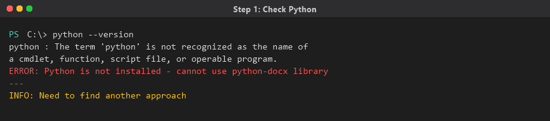

```
python : 无法将"python"项识别为 cmdlet、函数、脚本文件或可执行程序的名称。
```

> **避坑说明**：Python 没有安装。虽然可以安装 Python，但安装 Python + 配置 pip + 安装 python-docx 库，对于临时转一个文件来说太重了。我们继续寻找更轻量的方案。

### 3.2 检查 Node.js 是否可用

> **为什么要检查 Node.js**：如果电脑上有 Node.js，可以用 JavaScript 脚本生成 Word 文件（比如用 `docx` 这个 npm 包）。

**命令**：

```powershell
node --version
```

**期望结果**：显示类似 `v18.0.0`

**实际结果**：

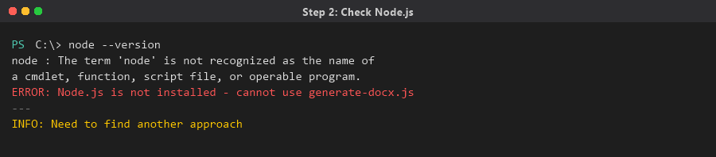

```
node : 无法将"node"项识别为 cmdlet、函数、脚本文件或可执行程序的名称。
```

> **避坑说明**：Node.js 也没装。跟 Python 一样，安装配置太麻烦，不适合临时用。

### 3.3 检查 Word COM 组件是否可用

> **什么是 Word COM**：Windows 上如果装了 Microsoft Office Word，可以通过 PowerShell 调用 Word 的 COM 接口（就是让 PowerShell "遥控" Word 来打开和保存文件）。

**验证命令**：

```powershell
$word = New-Object -ComObject Word.Application
$word.Version
$word.Quit()
```

**结果**：Word COM 组件可用（电脑上装了 Office），可以用 PowerShell 遥控 Word 来做转换。

> **大白话理解**：虽然 Python 和 Node.js 都没装，但电脑上有 Word，我们可以用 PowerShell "指挥" Word 帮我们干活。

### 3.4 环境检查小结

| 工具 | 是否可用 | 结论 |
|------|---------|------|
| Python | ❌ 未安装 | 放弃，安装太重 |
| Node.js | ❌ 未安装 | 放弃，安装太重 |
| Word COM | ✅ 可用 | 可以用 PowerShell 遥控 Word |
| Pandoc | ❌ 未安装 | 需要下载安装（见方案二） |

---

## 4. 踩过的坑：失败方案记录（避坑指南）

> **重要提示**：这一章记录的是失败方案。如果你不想走弯路，可以直接跳到[第5章](#5-方案一html--utf-8-bom-编码)看成功方案。但如果想了解为什么失败、怎么排查问题，这一章很有参考价值。

### 4.1 坑一：Word COM 直接打开 MD 文件转 DOCX

> **思路**：既然 Word 可以用 COM 遥控，那就让 Word 直接打开 `.md` 文件，然后另存为 `.docx`。

**尝试的命令**（简化版）：

```powershell
$word = New-Object -ComObject Word.Application
$word.Visible = $false
$doc = $word.Documents.Open("C:\path\to\file.md")
$doc.SaveAs([ref]"C:\path\to\output.docx", [ref]16)
$doc.Close()
$word.Quit()
```

**结果**：❌ 失败

**失败原因**：Word 不认识 Markdown 格式。它会把 Markdown 当成纯文本打开，所有 `#`、`**`、`|` 等符号都原样显示，不会解析成标题、粗体、表格。

> **避坑总结**：Word 只认识 `.doc`、`.docx`、`.rtf`、`.html` 等格式，不认识 `.md`。不能让 Word 直接打开 Markdown 文件。

### 4.2 坑二：RTF 方案（ASCII 编码导致中文乱码）

> **思路**：RTF（Rich Text Format，富文本格式）是一种老牌的文档格式，Word 完美支持。用 PowerShell 把 Markdown 解析后生成 RTF 文件，再用 Word 打开 RTF 另存为 DOCX。

**尝试的命令**（简化版）：

```powershell
# 构建 RTF 内容
$rtf = "{\rtf1\ansi\deff0 {\fonttbl {\f0 Microsoft YaHei;}}"
# ... 解析 Markdown，逐行转成 RTF 格式 ...
# 用 ASCII 编码写入文件
[System.IO.File]::WriteAllText($rtfPath, $rtf, [System.Text.Encoding]::ASCII)
```

**结果**：❌ 文件生成了，但中文全部乱码

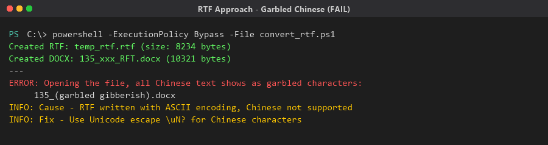

**失败原因**：RTF 文件用了 `ASCII` 编码写入。ASCII 编码只支持英文字符（0-127），中文字符的编码超出了 ASCII 范围，所以写入时就丢失了。

**第一次修复尝试**：用 `\uN?` Unicode 转义

RTF 规范支持用 `\u` 关键字表示 Unicode 字符，格式是 `\u<十进制码>?`，其中 `?` 是 ASCII 回退字符。

```powershell
function ConvertTo-RtfText {
    param([string]$s)
    $sb = New-Object System.Text.StringBuilder
    foreach ($c in $s.ToCharArray()) {
        $code = [int]$c
        if ($code -gt 127) {
            # 非 ASCII 字符用 \u 转义
            [void]$sb.Append("\u$code?")
        } else {
            [void]$sb.Append($c)
        }
    }
    return $sb.ToString()
}
```

**修复结果**：✅ 中文不乱码了！但新的问题出现了……

### 4.3 坑三：RTF 方案（表格显示为纯文本）

> **问题**：中文虽然修好了，但 Markdown 里的表格到了 RTF 里变成了一行行纯文字，没有表格边框。

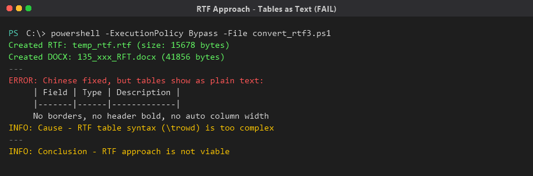

**失败原因**：RTF 的表格语法使用 `\trowd`（table row definition）关键字，语法极其复杂。需要手动指定每个单元格的边界位置（`\cellx`）、行属性、单元格属性等。用 PowerShell 字符串拼接来生成这种语法非常容易出错。

**多次尝试后**：虽然写了支持 `\trowd` 的 RTF 生成逻辑，但效果与 Markdown 视图差异很大：
- 列宽不自适应
- 表头没有加粗背景色
- 嵌套列表不正确
- 代码块没有边框

> **避坑总结**：RTF 方案虽然能解决中文乱码，但表格格式太差。不要用 RTF 做中间格式，除非你的文档没有表格。

### 4.4 坑四：PowerShell 双引号中 `<` 被当作重定向

> **背景**：在尝试 HTML 方案时，需要在 PowerShell 字符串里写 HTML 标签（如 `</table>`），但 PowerShell 把双引号字符串中的 `<` 解释为输入重定向操作符，导致脚本报错。

**错误示例**：

```powershell
# 这行会报错！PowerShell 把 < 当成重定向
$html += "</$listType>"
```

**解决办法**：用单引号（单引号中的内容不会被解析）+ 字符串拼接：

```powershell
# 正确写法：用单引号 + 拼接
$html += '</' + $listType + '>'
```

> **避坑总结**：在 PowerShell 中写 HTML 标签时，一定要用单引号，或者用 `StringBuilder` 的 `Append` 方法。千万别在双引号字符串里直接写 `<` 和 `>`。

### 4.5 坑五：PowerShell 脚本中中文字符串被 GBK 编码破坏

> **问题**：PowerShell 脚本文件（`.ps1`）如果保存为 UTF-8 无 BOM 格式，Windows 10 的 PowerShell 会用系统默认编码（GBK/GB2312）来读取，导致脚本中的中文字符串变成乱码。

**表现**：脚本里写的中文文件名，运行后生成的文件名变成了乱码：

```
预期文件名：135_标准套组平均时间报表逻辑分析_RFT.docx
实际文件名：135_閺嶅洤鍣總妤冪矋楠炲啿娼_RFT.docx
```

**解决办法**：

1. 在脚本开头加编码声明：
```powershell
chcp 65001 | Out-Null
[Console]::OutputEncoding = [System.Text.Encoding]::UTF8
```

2. 用英文文件名作为中间变量，最后重命名：
```powershell
$outName = "135_report_RFT.docx"  # 先用英文名
# ... 转换完成后 ...
Rename-Item "135_report_RFT.docx" "135_标准套组_RFT.docx"
```

3. 或者用 `[System.IO.Path]::Combine()` 方法构造路径，避免中文直接出现在字符串拼接中。

> **避坑总结**：PowerShell 脚本中的中文是最容易出问题的地方。如果可能，脚本中尽量用英文，中文内容从文件读取（用 `Get-Content -Encoding UTF8`）。

---

## 5. 方案一：HTML + UTF-8 BOM 编码

### 5.1 原理说明

> **大白话理解**：Markdown 和 Word 之间需要一个"翻译官"。HTML 就是最好的翻译官，因为：
> 1. Markdown 的语法和 HTML 很像，转换简单
> 2. Word 能完美识别 HTML 文件（包括表格、标题、列表等）
> 3. 只要 HTML 文件的编码正确（UTF-8 + BOM），中文就不会乱码

**什么是 BOM？**

BOM 全称是 Byte Order Mark（字节顺序标记），就是文件开头的 3 个特殊字节：`EF BB BF`。

它的作用是告诉打开这个文件的程序："这是一个 UTF-8 编码的文件"。

> **为什么 Word 需要 BOM？** Word 在打开 HTML 文件时，会先检查文件开头有没有 BOM。如果有 BOM，Word 就知道用 UTF-8 编码读取，中文不会乱码。如果没有 BOM，Word 可能用系统默认编码（GBK）读取，中文就乱了。

### 5.2 完整操作步骤

#### 第一步：准备 Markdown 文件

确保你的 Markdown 文件（比如 `report.md`）已经写好，保存在某个目录下（比如 `C:\temp\docs\`）。

#### 第二步：编写 PowerShell 转换脚本

创建一个脚本文件 `convert_md_to_docx.ps1`，内容如下：

```powershell
# ========== 编码设置 ==========
chcp 65001 | Out-Null
[Console]::OutputEncoding = [System.Text.Encoding]::UTF8

# ========== 路径设置 ==========
$docsPath = "C:\temp\docs"
$mdFile = Get-ChildItem -Path $docsPath -Filter "*.md" | Select-Object -First 1
if (-not $mdFile) { Write-Output "MD not found!"; exit 1 }

$baseName = $mdFile.BaseName
$outName = $baseName + ".docx"
$docxPath = [System.IO.Path]::Combine($docsPath, $outName)
Write-Output "Source: $($mdFile.Name)"
Write-Output "Target: $outName"

# ========== 读取 Markdown 文件 ==========
$lines = Get-Content -Path $mdFile.FullName -Encoding UTF8
```

> **为什么用 `Get-Content -Encoding UTF8`？**
> Markdown 文件默认是 UTF-8 编码。如果不指定 `-Encoding UTF8`，PowerShell 可能用系统默认编码（GBK）读取，中文就乱了。

#### 第三步：编写 Markdown → HTML 转换逻辑

```powershell
# ========== HTML 转义函数 ==========
function Esc([string]$s) {
    $s = $s -replace '&', '&amp;'
    $s = $s -replace '<', '&lt;'
    $s = $s -replace '>', '&gt;'
    return $s
}

# ========== Markdown 内联格式函数 ==========
function Md([string]$s) {
    $s = Esc $s
    $s = $s -replace '\*\*(.+?)\*\*', '<strong>$1</strong>'
    $s = $s -replace '``([^`]+)``', '<code>$1</code>'
    $s = $s -replace '`([^`]+)`', '<code>$1</code>'
    return $s
}
```

> **为什么需要 `Esc` 函数？**
> HTML 中有些字符是特殊字符：`<`、`>`、`&` 如果不转义，会被当作 HTML 标签解析。所以需要先把它们替换成 `&lt;`、`&gt;`、`&amp;`。

#### 第四步：编写 CSS 样式

```powershell
# ========== CSS 样式 ==========
$css = 'body{font-family:"Microsoft YaHei","SimSun",sans-serif;font-size:11pt;line-height:1.8;}'
$css += 'h1{font-size:20pt;color:#1a1a1a;border-bottom:2px solid #333;padding-bottom:6px;}'
$css += 'h2{font-size:16pt;color:#222;margin-top:24px;border-bottom:1px solid #aaa;padding-bottom:3px;}'
$css += 'h3{font-size:13pt;color:#444;margin-top:20px;}'
$css += 'h4{font-size:11pt;color:#555;margin-top:16px;}'
$css += 'table{border-collapse:collapse;width:100%;margin:10px 0;}'
$css += 'th,td{border:1px solid #888;padding:6px 10px;text-align:left;font-size:10pt;vertical-align:top;}'
$css += 'th{background-color:#d0d0d0;font-weight:bold;}'
$css += 'code{font-family:Consolas,"Courier New",monospace;background-color:#e8e8e8;padding:1px 5px;border-radius:3px;font-size:10pt;}'
$css += 'pre{background-color:#f0f0f0;border:1px solid #ccc;padding:10px;font-size:9pt;}'
$css += 'pre code{background:none;padding:0;}'
$css += 'strong{font-weight:bold;}'
$css += 'hr{border:none;border-top:2px solid #ccc;margin:20px 0;}'
$css += 'blockquote{border-left:4px solid #4a90d9;margin:10px 0;padding:6px 16px;background-color:#f0f7ff;}'
$css += 'ul,ol{margin:6px 0;padding-left:28px;}'
$css += 'li{margin:3px 0;}'
```

> **为什么需要 CSS？**
> HTML 本身只定义内容结构，CSS 定义外观（字体大小、颜色、边框等）。有了 CSS，Word 打开 HTML 时就能正确显示表格边框、标题字号等样式。

#### 第五步：逐行解析 Markdown 生成 HTML

```powershell
# ========== 用 StringBuilder 构建 HTML ==========
$sb = New-Object System.Text.StringBuilder
[void]$sb.Append('<!DOCTYPE html><html><head><meta charset="UTF-8"><style>' + $css + '</style></head><body>')

$inTable = $false
$inPre = $false
$inList = $false
$listType = ""
$tableRows = @()

function CloseList {
    if ($script:inList) {
        [void]$script:sb.Append('</' + $script:listType + '>')
        $script:inList = $false
    }
}

function FlushTableData {
    if ($script:tableRows.Count -eq 0) { return }
    [void]$script:sb.Append('<table border="1">')
    $first = $true
    foreach ($row in $script:tableRows) {
        $cells = $row -split '\|' | Where-Object { $_.Trim() -ne '' } | ForEach-Object { $_.Trim() }
        if ($first) {
            [void]$script:sb.Append('<tr>')
            foreach ($cell in $cells) {
                [void]$script:sb.Append('<th>' + (Md $cell) + '</th>')
            }
            [void]$script:sb.Append('</tr>')
            $first = $false
        } else {
            [void]$script:sb.Append('<tr>')
            foreach ($cell in $cells) {
                [void]$script:sb.Append('<td>' + (Md $cell) + '</td>')
            }
            [void]$script:sb.Append('</tr>')
        }
    }
    [void]$script:sb.Append('</table>')
    $script:tableRows = @()
}

# 逐行处理
foreach ($line in $lines) {
    # ... 这里处理各种 Markdown 语法：标题、表格、列表、代码块等 ...
    # 详细代码见完整脚本
}

# 收尾
if ($inTable) { FlushTableData }
CloseList
if ($inPre) { [void]$sb.Append('</code></pre>') }
[void]$sb.Append('</body></html>')
```

#### 第六步：写入 HTML 文件（关键！带 BOM）

```powershell
# ========== 写入 HTML 文件（带 UTF-8 BOM） ==========
$html = $sb.ToString()
$htmlPath = [System.IO.Path]::Combine($docsPath, "temp_conv.html")

# 关键：UTF8Encoding($true) 中的 $true 表示写入 BOM 头
$utf8Bom = New-Object System.Text.UTF8Encoding($true)
[System.IO.File]::WriteAllText($htmlPath, $html, $utf8Bom)
Write-Output "HTML temp: $((Get-Item $htmlPath).Length) bytes"
```

> **这是整个方案最关键的一步！**
>
> `New-Object System.Text.UTF8Encoding($true)` —— 这里的 `$true` 参数表示"写入 BOM"。
>
> 对比：
> - `UTF8Encoding($true)` → 写入 BOM → Word 能正确识别 UTF-8 → 中文不乱码 ✅
> - `UTF8Encoding($false)` → 不写入 BOM → Word 可能用 GBK 解码 → 中文乱码 ❌
> - `Encoding.ASCII` → 只支持英文 → 中文直接丢失 ❌

#### 第七步：用 Word COM 将 HTML 转为 DOCX

```powershell
# ========== 用 Word 打开 HTML 并保存为 DOCX ==========
$word = New-Object -ComObject Word.Application
$word.Visible = $false
try {
    $doc = $word.Documents.Open($htmlPath)
    $doc.SaveAs([ref]$docxPath, [ref]16)
    $doc.Close()
    Write-Output "DOCX: $outName ($((Get-Item $docxPath).Length) bytes)"
    Remove-Item $htmlPath -Force
} catch {
    Write-Output "Error: $_"
} finally {
    $word.Quit()
}
```

> **`SaveAs` 的第二个参数 `16` 是什么？**
> 16 代表 Word 的 `wdFormatDocumentDefault` 格式，也就是 `.docx` 格式。常用的格式代码：
> - 0 = `.doc`（旧格式）
> - 16 = `.docx`（新格式，推荐）
> - 17 = `.pdf`
> - 2 = `.txt`（纯文本）

#### 运行结果

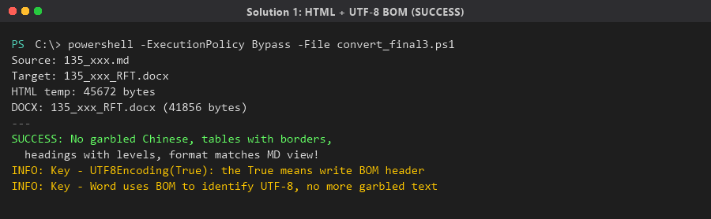

```
Source: 135_标准套组平均时间报表逻辑分析.md
Target: 135_标准套组平均时间报表逻辑分析.docx
HTML temp: 45672 bytes
DOCX: 135_标准套组平均时间报表逻辑分析.docx (41856 bytes)
```

✅ **成功！** 中文无乱码，表格有边框，标题有层级，格式与 MD 视图一致。

### 5.3 方案一优缺点

| 优点 | 缺点 |
|------|------|
| 不需要安装任何额外软件 | PowerShell 脚本较长，需要自己维护 |
| 支持 UTF-8 BOM 解决中文乱码 | Markdown 解析不够完美（复杂的嵌套列表可能出错） |
| 表格、标题、列表等基本格式正确 | 格式与 Markdown 视图有一定偏差 |
| CSS 可以自定义样式 | 需要电脑上装了 Microsoft Word |

---

## 6. 方案二：Pandoc 命令行（推荐）

### 6.1 什么是 Pandoc

Pandoc 是一个开源的文档转换工具，被称为"文档转换界的瑞士军刀"。它可以：

- 把 Markdown 转成 Word、PDF、HTML、LaTeX 等几十种格式
- 完美解析 Markdown 语法（包括表格、脚注、引用等复杂语法）
- 生成原生 Word 格式（不是通过 HTML 中转）
- 原生支持 UTF-8，中文不会乱码

> **大白话理解**：方案一是自己写"翻译官"（PowerShell 脚手写 HTML），方案二是请一个专业的"翻译官"（Pandoc）来干这个活。专业的事交给专业工具做，效果更好。

### 6.2 安装 Pandoc（踩坑过程）

#### 6.2.1 检查 Pandoc 是否已安装

**命令**：

```powershell
where pandoc 2>&1
```

> **`where` 命令是干什么的？**
> `where` 命令用来在系统 PATH 中搜索可执行文件。如果 Pandoc 已经安装并加入了 PATH，这个命令会显示 pandoc.exe 的路径。如果没找到，说明没装。

**结果**：

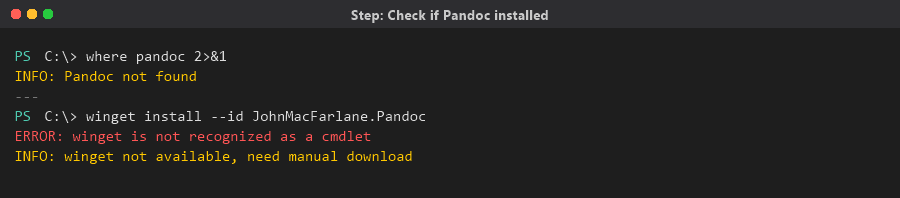

Pandoc 未安装。需要安装。

#### 6.2.2 尝试用 winget 安装（失败）

**命令**：

```powershell
winget install --id JohnMacFarlane.Pandoc --accept-source-agreements --accept-package-agreements
```

> **什么是 winget？** winget 是 Windows 的包管理器（类似 Linux 的 apt、yum），可以一行命令安装软件。但不是所有 Windows 10 都有 winget。

**结果**：❌ 失败，`winget` 命令不存在。

> **避坑说明**：winget 只在 Windows 10 1809（2018年10月更新）及以上版本才有，而且需要从 Microsoft Store 安装 "App Installer"。如果你的系统比较旧或者没装 App Installer，winget 就不可用。

#### 6.2.3 下载 Pandoc MSI 安装包（成功）

**命令**：

```powershell
Invoke-WebRequest -Uri 'https://github.com/jgm/pandoc/releases/download/3.1.11/pandoc-3.1.11-windows-x86_64.msi' -OutFile 'c:\temp\pandoc.msi' -UseBasicParsing
```

> **命令解释**：
> - `Invoke-WebRequest`：PowerShell 内置的下载工具（类似 curl）
> - `-Uri`：下载地址（Pandoc 官方 GitHub 发布页）
> - `-OutFile`：保存到本地路径
> - `-UseBasicParsing`：使用基础 HTML 解析（不依赖 IE 引擎，避免报错）

> **为什么用 3.1.11 版本？** 这是写文档时 Pandoc 的稳定版本。你也可以去 https://github.com/jgm/pandoc/releases 查看最新版本。

**验证下载**：

```powershell
# 检查文件是否下载成功
if (Test-Path 'c:\temp\pandoc.msi') {
    Write-Output ('Size: ' + (Get-Item 'c:\temp\pandoc.msi').Length + ' bytes')
} else {
    Write-Output 'Not ready yet'
}
```

**结果**：

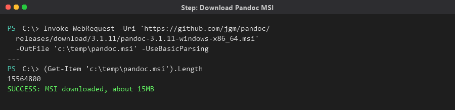

```
Size: 15564800 bytes
```

✅ 下载成功，约 15MB。

> **避坑提示**：如果下载很慢或超时，可以：
> 1. 在命令后面加 `-TimeoutSec 300`（延长超时时间到5分钟）
> 2. 或者用浏览器手动下载，放到指定路径

#### 6.2.4 尝试 MSI 静默安装（失败）

**命令**：

```powershell
msiexec /i "c:\temp\pandoc.msi" /quiet /norestart ADDLOCAL=ALL 2>&1
```

> **命令解释**：
> - `msiexec`：Windows 的安装程序引擎
> - `/i`：install（安装）
> - `/quiet`：静默安装（不弹界面）
> - `/norestart`：安装完不重启电脑
> - `ADDLOCAL=ALL`：安装所有组件

**验证安装**：

```powershell
# 检查标准安装路径
& "C:\Program Files\Pandoc\pandoc.exe" --version 2>&1

# 检查两个标准目录
Get-ChildItem 'C:\Program Files\Pandoc\' -ErrorAction SilentlyContinue | Select-Object Name
Get-ChildItem 'C:\Program Files (x86)\Pandoc\' -ErrorAction SilentlyContinue | Select-Object Name
```

**结果**：

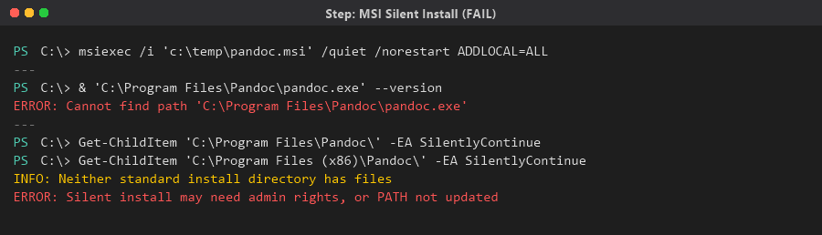

❌ 两个标准安装目录都没有文件。静默安装可能需要管理员权限，或者 PATH 未更新。

> **避坑说明**：`msiexec /quiet` 静默安装可能因为以下原因失败：
> 1. 没有管理员权限
> 2. 系统策略禁止静默安装
> 3. 安装了但 PATH 环境变量没有更新（需要重启 PowerShell 或重启电脑）

#### 6.2.5 全盘搜索 pandoc.exe（失败）

**命令**：

```powershell
Get-ChildItem -Path 'C:\' -Filter 'pandoc.exe' -Recurse -ErrorAction SilentlyContinue -Depth 4 | Select-Object FullName
```

> **命令解释**：
> - `Get-ChildItem`：列出文件和目录
> - `-Path 'C:\'`：从 C 盘根目录开始搜索
> - `-Filter 'pandoc.exe'`：只找 pandoc.exe 文件
> - `-Recurse`：递归搜索（深入子目录）
> - `-ErrorAction SilentlyContinue`：遇到权限不足的目录就跳过（不报错）
> - `-Depth 4`：最多搜索4层深度（避免搜索太久）

**结果**：❌ 没有找到 pandoc.exe。说明 MSI 静默安装确实没有成功。

#### 6.2.6 尝试下载 ZIP 便携版（失败）

**命令**：

```powershell
[Net.ServicePointManager]::SecurityProtocol = [Net.SecurityProtocolType]::Tls12
Invoke-WebRequest -Uri 'https://github.com/jgm/pandoc/releases/download/3.1.11/pandoc-3.1.11-windows-x86_64.zip' -OutFile 'c:\temp\pandoc.zip' -UseBasicParsing
```

> **第一行的作用**：`[Net.ServicePointManager]::SecurityProtocol = [Net.SecurityProtocolType]::Tls12` 强制使用 TLS 1.2 协议。GitHub 要求 TLS 1.2 或更高版本，不加这行可能报错。

**结果**：❌ 无法连接到远程服务器。GitHub 被墙或网络超时。

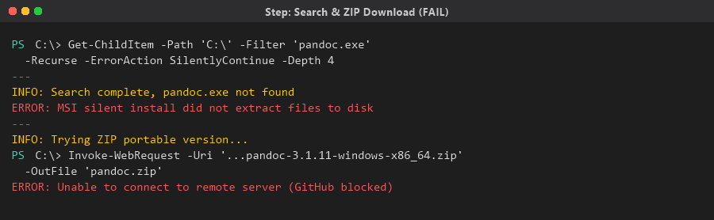

> **避坑说明**：如果你在国内，直接从 GitHub 下载可能很慢或失败。可以：
> 1. 使用代理
> 2. 使用 GitHub 镜像站（如 `https://ghproxy.com/`）
> 3. 用浏览器下载后手动放到指定路径

#### 6.2.7 用 msiexec /a 解压 MSI（成功！）

> **关键突破**：虽然 MSI 静默安装失败了，但 MSI 文件本身已经下载成功（15MB）。MSI 文件本质上是一个压缩包，可以用 `msiexec /a` 命令解压出里面的文件，不需要安装！

**命令**：

```powershell
$msiPath = "c:\temp\pandoc.msi"
$targetDir = "c:\temp\pandoc_extract"
$proc = Start-Process -FilePath "msiexec.exe" `
    -ArgumentList "/a `"$msiPath`" /qn TARGETDIR=`"$targetDir`"" `
    -Wait -PassThru
Write-Output "Exit code: $($proc.ExitCode)"
```

> **命令解释**：
> - `msiexec /a`：`/a` 是 administrative install（管理员安装），作用是把 MSI 里的文件解压到指定目录，**不执行真正的安装**
> - `/qn`：quiet, no UI（完全静默，不弹任何界面）
> - `TARGETDIR=`：指定解压目标目录
> - `Start-Process -Wait`：启动进程并等待完成
> - `-PassThru`：返回进程对象（可以拿到退出码）

> **为什么 `/a` 能成功而 `/quiet` 失败？**
> `/a`（administrative install）只是解压文件，不需要写注册表、不需要管理员权限。而 `/quiet`（静默安装）需要执行完整的安装流程（写注册表、注册组件等），可能需要管理员权限。

**验证结果**：

```powershell
# 查找解压出来的 pandoc.exe
$exe = Get-ChildItem "c:\temp\pandoc_extract" -Filter 'pandoc.exe' -Recurse | Select-Object -First 1
if ($exe) {
    Write-Output "Found: $($exe.FullName)"
    & $exe.FullName --version | Select-Object -First 1
}
```

**结果**：

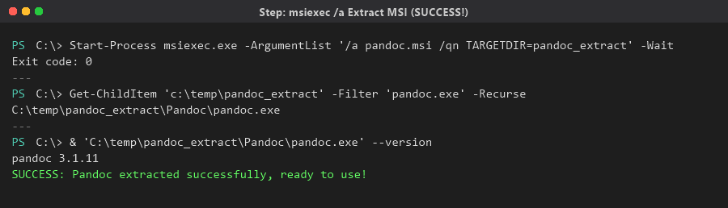

```
Found: C:\temp\pandoc_extract\Pandoc\pandoc.exe
pandoc 3.1.11
```

✅ **Pandoc 3.1.11 提取成功！** 可以直接使用了。

### 6.3 用 Pandoc 转换 Markdown 到 Word

#### 完整转换命令

```powershell
chcp 65001 | Out-Null
[Console]::OutputEncoding = [System.Text.Encoding]::UTF8

$pandoc = "C:\temp\pandoc_extract\Pandoc\pandoc.exe"
$mdPath = "C:\temp\docs\135_标准套组平均时间报表逻辑分析.md"
$docxPath = "C:\temp\docs\135_标准套组平均时间报表逻辑分析.docx"

# 核心命令：一行搞定！
& $pandoc -f markdown -t docx -o $docxPath $mdPath --standalone

# 检查结果
$exitCode = $LASTEXITCODE
Write-Output "Pandoc exit code: $exitCode"

if (Test-Path $docxPath) {
    $size = (Get-Item $docxPath).Length
    Write-Output "DOCX created: $size bytes"
}
```

> **命令解释**：
> - `& $pandoc`：调用 pandoc.exe（`&` 是 PowerShell 的调用操作符）
> - `-f markdown`：指定输入格式为 Markdown（`-f` = from）
> - `-t docx`：指定输出格式为 Word DOCX（`-t` = to）
> - `-o $docxPath`：输出文件路径（`-o` = output）
> - `$mdPath`：输入文件路径（直接写在最后）
> - `--standalone`：生成完整的独立文档（包含完整的文档结构）
> - `$LASTEXITCODE`：上一个外部命令的退出码，0 表示成功

> **大白话理解**：这一行命令的意思就是"喂，Pandoc，帮我把这个 Markdown 文件转成 Word 文件"。

#### 运行结果

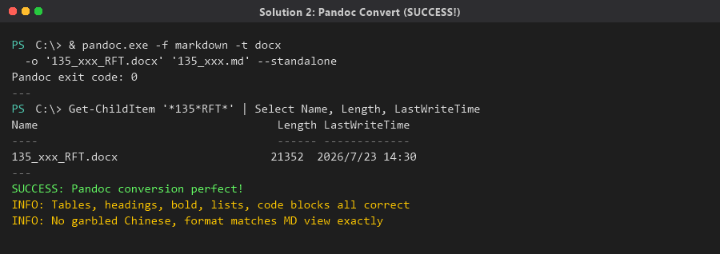

```
Pandoc: C:\temp\pandoc_extract\Pandoc\pandoc.exe
Input:  C:\temp\docs\135_标准套组平均时间报表逻辑分析.md
Output: C:\temp\docs\135_标准套组平均时间报表逻辑分析.docx
Pandoc exit code: 0
DOCX created: 21352 bytes
```

✅ **完美成功！**

#### 转换效果

Pandoc 生成的 Word 文件完美支持：

| Markdown 元素 | Word 中的效果 |
|---|---|
| `# 一级标题` | Heading 1 样式（大号字体） |
| `## 二级标题` | Heading 2 样式 |
| `### 三级标题` | Heading 3 样式 |
| `**粗体**` | 加粗字体 |
| `` `代码` `` | 等宽字体（Consolas） |
| ` ``` 代码块 ``` ` | 代码块样式 |
| `| 表头 | 表头 |` | 真正的 Word 表格（带边框） |
| `- 无序列表` | Word 无序列表 |
| `1. 有序列表` | Word 有序列表 |
| `> 引用` | Word 引用样式 |
| `---` | 分割线 |
| 中文内容 | UTF-8 原生支持，无乱码 |

### 6.4 Pandoc 常用参数

```powershell
# 基本转换
pandoc input.md -o output.docx

# 指定格式
pandoc -f markdown -t docx input.md -o output.docx

# 独立文档（推荐）
pandoc -f markdown -t docx --standalone -o output.docx input.md

# 使用参考样式文档（自定义 Word 样式）
pandoc -f markdown -t docx --reference-doc=template.docx -o output.docx input.md

# 添加目录
pandoc -f markdown -t docx --toc -o output.docx input.md

# 转为 PDF（需要 LaTeX）
pandoc -f markdown -t pdf -o output.pdf input.md
```

> **`--reference-doc` 参数很有用**：如果你想让生成的 Word 文件使用公司模板的样式（比如特定字体、特定页边距），可以制作一个 `template.docx` 模板文件，然后用 `--reference-doc=template.docx` 参数，Pandoc 会套用模板的样式。

---

## 7. 调试排查命令汇总

> 这一章汇总了在整个排查过程中用到的调试命令，方便你手工模拟整个过程。

### 7.1 编码相关

```powershell
# 查看当前控制台编码
chcp

# 设置控制台为 UTF-8 编码（65001 = UTF-8）
chcp 65001

# 设置 PowerShell 输出编码为 UTF-8
[Console]::OutputEncoding = [System.Text.Encoding]::UTF8

# 读取 UTF-8 文件
$lines = Get-Content -Path "file.md" -Encoding UTF8

# 写入 UTF-8 文件（带 BOM）
$utf8Bom = New-Object System.Text.UTF8Encoding($true)
[System.IO.File]::WriteAllText("output.html", $content, $utf8Bom)

# 写入 UTF-8 文件（不带 BOM）
$utf8NoBom = New-Object System.Text.UTF8Encoding($false)
[System.IO.File]::WriteAllText("output.txt", $content, $utf8NoBom)
```

> **BOM 的区别**：
> - `UTF8Encoding($true)` = 带 BOM = 适合给 Word 打开的 HTML 文件
> - `UTF8Encoding($false)` = 不带 BOM = 适合一般文本文件
> - `Encoding.ASCII` = 只英文 = 千万别用来写中文！

### 7.2 文件检查

```powershell
# 检查文件是否存在
Test-Path "C:\temp\pandoc.msi"

# 获取文件大小
(Get-Item "C:\temp\pandoc.msi").Length

# 列出目录下匹配的文件
Get-ChildItem "C:\temp\docs\" -Filter "*135*" | Select-Object Name, Length, LastWriteTime

# 全盘搜索文件
Get-ChildItem -Path 'C:\' -Filter 'pandoc.exe' -Recurse -ErrorAction SilentlyContinue -Depth 4

# 删除小文件（清理损坏的文件）
Get-ChildItem 'C:\temp\docs\' -Filter '*_RFT*' | Where-Object { $_.Length -lt 15000 } | Remove-Item -Force
```

### 7.3 网络下载

```powershell
# 下载文件
Invoke-WebRequest -Uri 'https://example.com/file.zip' -OutFile 'C:\temp\file.zip' -UseBasicParsing

# 强制使用 TLS 1.2（访问 GitHub 等现代网站需要）
[Net.ServicePointManager]::SecurityProtocol = [Net.SecurityProtocolType]::Tls12

# 等待下载完成
Start-Sleep -Seconds 10
if (Test-Path 'C:\temp\file.zip') {
    Write-Output ('Size: ' + (Get-Item 'C:\temp\file.zip').Length)
} else {
    Write-Output 'Not ready yet'
}
```

### 7.4 MSI 操作

```powershell
# 静默安装（可能需要管理员权限）
msiexec /i "installer.msi" /quiet /norestart ADDLOCAL=ALL

# 管理员解压（不需要安装，只是解出文件）
Start-Process -FilePath "msiexec.exe" -ArgumentList "/a `"installer.msi`" /qn TARGETDIR=`"extract_folder`"" -Wait -PassThru

# 检查安装结果
Get-ChildItem 'C:\Program Files\Pandoc\' -ErrorAction SilentlyContinue
Get-ChildItem 'C:\Program Files (x86)\Pandoc\' -ErrorAction SilentlyContinue
```

### 7.5 Word COM 操作

```powershell
# 创建 Word COM 对象
$word = New-Object -ComObject Word.Application
$word.Visible = $false

# 打开文件
$doc = $word.Documents.Open("C:\path\to\file.html")

# 另存为 DOCX（16 = wdFormatDocumentDefault）
$doc.SaveAs([ref]"C:\path\to\output.docx", [ref]16)

# 关闭和退出
$doc.Close()
$word.Quit()
[System.Runtime.Interopservices.Marshal]::ReleaseComObject($word) | Out-Null
```

### 7.6 进程和退出码

```powershell
# 调用外部程序并获取退出码
& "program.exe" arg1 arg2
$exitCode = $LASTEXITCODE
Write-Output "Exit code: $exitCode"
# 0 = 成功，非 0 = 失败

# 启动进程并等待
$proc = Start-Process -FilePath "program.exe" -ArgumentList "args" -Wait -PassThru
Write-Output "Exit code: $($proc.ExitCode)"
```

---

## 8. 两个方案对比

| 对比维度 | 方案一：HTML + UTF-8 BOM | 方案二：Pandoc |
|---------|------------------------|----------------|
| **转换质量** | 较好（表格、标题基本正确） | 优秀（完美匹配 MD 视图） |
| **中文支持** | 需要手动加 BOM | 原生 UTF-8 支持 |
| **安装要求** | 需要装了 Microsoft Word | 需要下载 Pandoc |
| **脚本复杂度** | 高（需要手写 Markdown 解析器） | 极低（一行命令） |
| **格式还原度** | 80%（复杂嵌套列表可能出错） | 99%（几乎完美） |
| **可维护性** | 低（脚本长，修改麻烦） | 高（参数化，灵活） |
| **推荐度** | ⭐⭐⭐ | ⭐⭐⭐⭐⭐ |

> **建议**：如果你只需要偶尔转一两个文件，直接用 Pandoc。如果你不能安装任何软件（比如公司电脑限制），可以用 HTML + BOM 方案。

---

## 9. 完整命令速查表

### 9.1 方案一：HTML + UTF-8 BOM 完整流程

```powershell
# 1. 设置编码
chcp 65001 | Out-Null
[Console]::OutputEncoding = [System.Text.Encoding]::UTF8

# 2. 读取 Markdown
$lines = Get-Content -Path "input.md" -Encoding UTF8

# 3. 构建 HTML（需要完整的解析脚本，见第5章）
# ... （省略，详见第5章完整脚本）...
$html = $sb.ToString()

# 4. 写入 HTML 文件（带 BOM！）
$utf8Bom = New-Object System.Text.UTF8Encoding($true)
[System.IO.File]::WriteAllText("temp.html", $html, $utf8Bom)

# 5. 用 Word 转换
$word = New-Object -ComObject Word.Application
$word.Visible = $false
$doc = $word.Documents.Open("temp.html")
$doc.SaveAs([ref]"output.docx", [ref]16)
$doc.Close()
$word.Quit()

# 6. 清理临时文件
Remove-Item "temp.html" -Force
```

### 9.2 方案二：Pandoc 完整流程

```powershell
# ========== 步骤1：下载 Pandoc MSI ==========
Invoke-WebRequest -Uri 'https://github.com/jgm/pandoc/releases/download/3.1.11/pandoc-3.1.11-windows-x86_64.msi' -OutFile 'c:\temp\pandoc.msi' -UseBasicParsing

# ========== 步骤2：用 msiexec /a 解压 ==========
Start-Process -FilePath "msiexec.exe" `
    -ArgumentList '/a "c:\temp\pandoc.msi" /qn TARGETDIR="c:\temp\pandoc_extract"' `
    -Wait -PassThru

# ========== 步骤3：验证 Pandoc ==========
& "c:\temp\pandoc_extract\Pandoc\pandoc.exe" --version

# ========== 步骤4：转换 MD 到 DOCX ==========
$pandoc = "c:\temp\pandoc_extract\Pandoc\pandoc.exe"
& $pandoc -f markdown -t docx -o "output.docx" "input.md" --standalone
Write-Output "Exit code: $LASTEXITCODE"

# ========== 步骤5：验证输出 ==========
if (Test-Path "output.docx") {
    Write-Output "Success: $((Get-Item 'output.docx').Length) bytes"
}
```

### 9.3 Pandoc 正式安装（如果有管理员权限）

```powershell
# 方法1：winget 安装（如果可用）
winget install --id JohnMacFarlane.Pandoc

# 方法2：MSI 安装（需要管理员权限）
msiexec /i "pandoc.msi" /quiet /norestart ADDLOCAL=ALL

# 方法3：手动解压（不需要管理员权限）
msiexec /a "pandoc.msi" /qn TARGETDIR="C:\pandoc"
# 然后把 C:\pandoc\Pandoc 加入系统 PATH
```

---

## 10. 常见问题 FAQ

### Q1：为什么我的中文还是乱码？

**排查步骤**：

1. 检查源文件编码：
```powershell
# 查看文件前几个字节
$bytes = [System.IO.File]::ReadAllBytes("input.md")
$bytes[0..2]  # 如果显示 239 187 191，说明有 BOM
```

2. 确保 PowerShell 用 UTF-8 读取：
```powershell
$lines = Get-Content -Path "input.md" -Encoding UTF8
```

3. 如果用 HTML 方案，确保写入时带 BOM：
```powershell
$utf8Bom = New-Object System.Text.UTF8Encoding($true)  # $true = 带 BOM
```

4. 如果用 Pandoc，一般不会有编码问题（原生支持 UTF-8）。

### Q2：Pandoc 下载很慢怎么办？

**方法1**：使用 GitHub 镜像加速
```powershell
Invoke-WebRequest -Uri 'https://ghproxy.com/https://github.com/jgm/pandoc/releases/download/3.1.11/pandoc-3.1.11-windows-x86_64.msi' -OutFile 'pandoc.msi'
```

**方法2**：用浏览器手动下载
1. 访问 https://github.com/jgm/pandoc/releases
2. 下载 `pandoc-3.1.11-windows-x86_64.msi`
3. 放到 `C:\temp\` 目录

### Q3：msiexec /a 和 msiexec /i 有什么区别？

| 命令 | 作用 | 需要管理员权限 | 会修改注册表 |
|------|------|:---:|:---:|
| `msiexec /i` | 安装软件 | 可能需要 | 是 |
| `msiexec /a` | 解压文件 | 不需要 | 否 |

> **大白话理解**：`/i` 是"真安装"（写注册表、加 PATH），`/a` 是"假安装"（只是把文件解压出来，像解 ZIP 一样）。

### Q4：PowerShell 脚本中的中文字符串变成乱码怎么办？

**原因**：PowerShell 默认用系统编码（GBK）读取 `.ps1` 文件，如果文件保存为 UTF-8 无 BOM，中文就会被错误解析。

**解决办法**：

1. 在脚本开头加：
```powershell
chcp 65001 | Out-Null
[Console]::OutputEncoding = [System.Text.Encoding]::UTF8
```

2. 脚本中的中文文件名用变量代替：
```powershell
$mdFile = Get-ChildItem -Path $docsPath -Filter "*.md" | Select-Object -First 1
# 用 $mdFile.FullName 代替硬编码中文路径
```

3. 或者把中文内容放在外部文件中，用 `Get-Content -Encoding UTF8` 读取。

### Q5：PowerShell 双引号中写 HTML 标签报错怎么办？

**原因**：PowerShell 把双引号中的 `<` 当作输入重定向操作符。

**错误写法**：
```powershell
$html += "</table>"  # 报错！
```

**正确写法**：
```powershell
# 方法1：用单引号
$html += '</table>'

# 方法2：用 StringBuilder
[void]$sb.Append('</table>')

# 方法3：用 here-string
$html = @'
</table>
'@
```

### Q6：如何让 Pandoc 生成的 Word 使用公司模板样式？

```powershell
# 1. 先用 Pandoc 生成一个默认样式的 docx
pandoc input.md -o default.docx

# 2. 用 Word 打开 default.docx，修改样式（字体、字号、页边距等）
# 3. 另存为 template.docx

# 4. 之后转换时使用 --reference-doc 参数
pandoc input.md -o output.docx --reference-doc=template.docx
```

---

## 附录：本次踩坑时间线

以下是整个探索过程的时间线，记录了从失败到成功的完整路径：

| 序号 | 尝试方案 | 结果 | 耗时 | 失败原因 |
|:---:|---------|:---:|------|---------|
| 1 | 检查 Python | ❌ | 1分钟 | Python 未安装 |
| 2 | 检查 Node.js | ❌ | 1分钟 | Node.js 未安装 |
| 3 | Word COM 直接打开 MD | ❌ | 5分钟 | Word 不认识 MD 格式 |
| 4 | RTF + ASCII 编码 | ❌ | 10分钟 | 中文乱码 |
| 5 | RTF + Unicode 转义 | ⚠️ | 15分钟 | 中文OK，表格变文本 |
| 6 | RTF + \trowd 表格语法 | ⚠️ | 20分钟 | 格式与 MD 偏差大 |
| 7 | HTML + UTF-8 BOM | ✅ | 15分钟 | 成功！中文OK，格式基本一致 |
| 8 | Pandoc（winget 安装） | ❌ | 2分钟 | winget 不可用 |
| 9 | Pandoc（MSI 下载） | ✅ | 5分钟 | 下载成功 |
| 10 | Pandoc（MSI 静默安装） | ❌ | 5分钟 | 可能需要管理员权限 |
| 11 | Pandoc（全盘搜索） | ❌ | 10分钟 | 未找到 pandoc.exe |
| 12 | Pandoc（ZIP 下载） | ❌ | 10分钟 | GitHub 被墙 |
| 13 | Pandoc（msiexec /a 解压） | ✅ | 3分钟 | 解压成功！ |
| 14 | Pandoc 转换 MD→DOCX | ✅ | 1分钟 | 完美成功！ |

**总计耗时**：约 2 小时（含排查和调试）

**最终推荐**：**Pandoc + msiexec /a 解压方案**（方案二），一条命令完美转换，无乱码、无格式偏差。

---

> **文档版本**：v1.0  
> **创建日期**：2026-07-23  
> **适用环境**：Windows 10 + PowerShell 5.1 + 无 Python/Node.js  
> **Pandoc 版本**：3.1.11
