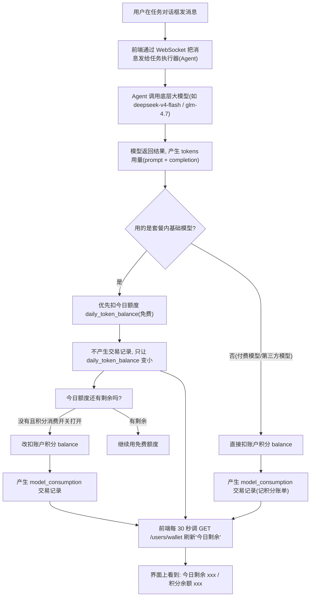

# MonkeyCode 今日额度消费链路 详解指南

> 目标：把 monkeycode-ai.com 平台上"今日额度"从**产生 → 消费 → 扣减 → 查询**的完整链路讲清楚：用户发一条消息后，平台内部到底发生了什么、扣了什么、去哪查、怎么验证。同时给出每一个相关接口的实测命令、返回数据、字段解释。
>
> 本文档用大白话写给"技术一般"的人看，每一步有命令、有解释、有你"应该看到的结果"、有踩坑提醒。如果你是需要照着这份文档做事的 Agent，请完整读一遍再动手，尤其注意每节的"为什么"和"避坑"。

---

## 目录

- [一、这次要搞清楚什么](#一这次要搞清楚什么)
- [二、需要提前准备什么](#二需要提前准备什么)
- [三、大白话背景知识（额度 / 积分 / 交易 / 套餐）](#三大白话背景知识额度--积分--交易--套餐)
- [四、完整消费链路全景图（一条消息从发出去到扣完额度）](#四完整消费链路全景图一条消息从发出去到扣完额度)
- [五、相关接口逐个讲解 + 实测](#五相关接口逐个讲解--实测)
- [六、交易记录字段详解（看懂你的"积分账单"）](#六交易记录字段详解看懂你的积分账单)
- [七、今日额度是怎么计算和刷新的](#七今日额度是怎么计算和刷新的)
- [八、积分从哪来、往哪去（获得/消费方式全清单）](#八积分从哪来往哪去获得消费方式全清单)
- [九、界面上在哪里看额度（前端展示链路）](#九界面上在哪里看额度前端展示链路)
- [十、后端统计链路（开源代码部分）](#十后端统计链路开源代码部分)
- [十一、平台闭源部分与推断说明](#十一平台闭源部分与推断说明)
- [十二、排查错误工具箱](#十二排查错误工具箱)
- [十三、本指南用到的"高级工具/功能"逐个说明](#十三本指南用到的高级工具功能逐个说明)
- [十四、常见问题 FAQ](#十四常见问题-faq)
- [十五、实测数据速查表](#十五实测数据速查表)

---

## 一、这次要搞清楚什么

monkeycode-ai.com 每个账号都有两类"钱"：

1. **今日额度（每日免费 tokens）**：每天给你一批免费 tokens 额度，用基础模型（套餐内模型）会优先扣这个，**扣完为止**。界面显示"今日剩余 xxx"。
2. **账户积分（积分余额）**：签到、邀请、充值、订阅赠送攒下来的积分。当日额度用完、或调用付费模型/工具时，会扣积分。

本指南回答四件事：

- **怎么消费的**：发一条消息，额度是怎么被扣掉的（触发点、扣哪里、记不记账）。
- **通过哪些接口调**：所有和额度/积分相关的接口，逐个给命令和返回数据。
- **哪些接口参与计算**：哪些接口的值会被"算进"额度里（余额、上限、已用、交易明细、任务 token 统计）。
- **怎么验证**：给一组真实账号的实测数据，照着做能对上。

---

## 二、需要提前准备什么

| 东西 | 说明 |
|------|------|
| 一台 Linux 电脑/服务器 | 本指南所有命令在 Linux 下执行。Windows 请装 WSL 或 Git Bash |
| Python 3 | 用来格式化 JSON。检查：`python3 --version` |
| curl | 命令行"网页浏览器"。检查：`curl --version` |
| git | 把文档提交到 GitHub 用 |
| 一个已注册的 monkeycode 账号 | 有登录 Cookie 才能查自己的额度 |

> 登录并拿到 Cookie 的方法，见仓库里另一份《MonkeyCode-额度查询与任务模型切换-搭建指南》第四节。

---

## 三、大白话背景知识（额度 / 积分 / 交易 / 套餐）

### 3.1 两个概念：今日额度 和 积分

| 名称 | 界面叫法 | 干什么用 | 每天重置吗 |
|------|---------|---------|-----------|
| **今日额度** | 会员额度 / 今日剩余 | 免费跑**基础模型**（套餐内模型） | **重置**（每天 0 点） |
| **积分** | 积分 / 余额 | 付费跑第三方模型、调用图片识别/文档解析/联网搜索等工具、额度用完后续用 | **不重置**（攒着用） |

### 3.2 三个关键数字（都在钱包接口里）

调用 `GET /api/v1/users/wallet` 会返回一个对象，里面有三个数字：

```json
{
  "balance": 143117,
  "daily_token_balance": 21790963,
  "daily_token_limit": 30000000
}
```

- `daily_token_limit`：**今日额度上限**。按套餐固定：基础会员每天 3000 万 tokens、专业会员 1 亿、旗舰会员 3 亿。
- `daily_token_balance`：**今日剩余额度**（还能用多少 tokens）。
- `balance`：**账户积分余额**。

由此可以推出第三个数字：

```
今日已用 tokens = daily_token_limit - daily_token_balance
                = 30000000 - 21790963
                = 8209037（约 821 万 tokens）
```

### 3.3 交易记录（Transaction）是什么

每次"积分变动"（获得或扣减）都会记一条账，存在交易记录里。界面上的"积分账单"页就是它。注意：**只扣积分才记账；扣免费额度（今日额度）不记账**——这是本指南最重要的结论之一，后文会反复强调。

### 3.4 套餐决定额度上限

| 套餐 | 每日额度上限 | 说明 |
|------|------------|------|
| basic（基础会员） | 每天 30M Token（3000 万） | 实测三个账号均为 30000000 |
| pro（专业会员） | 每天 100M Token（1 亿） | |
| ultra（旗舰会员） | 每天 300M Token（3 亿） | |

套餐里还有"每月赠送积分"、任务并发数、云开发环境等权益。**每日额度不足时，可以消耗积分继续使用**（前提是"积分消费"开关打开，默认打开）。

---

## 四、完整消费链路全景图（一条消息从发出去到扣完额度）

> 这一节是全篇核心。用一句话概括：**发消息 → Agent 调模型产生 tokens → 优先扣免费额度（不记账）→ 免费额度用完后扣积分（记账）→ 前端每 30 秒刷新给你看**。



### 4.1 各环节详细说明

**第 1 步：发消息（触发点）**
用户在任务里输入消息，前端通过任务控制 WebSocket（`wss://monkeycode-ai.com/api/v1/users/tasks/control?id=<任务ID>`）把用户输入发给任务执行器。这是"消费"的起点。

**第 2 步：Agent 调模型（产生消耗）**
任务执行器（Agent）调用底层大模型。每一次模型调用都会产生两类 tokens：
- 输入 tokens（prompt，你发的话 + 上下文）
- 输出 tokens（completion，模型回答的话）

**第 3 步：计费判定（扣哪里）**
平台按"这次调用的模型"决定扣哪里：
- 套餐内**基础模型** → 优先扣**今日额度**（免费，不记账）
- **付费模型 / 第三方模型**（gpt、deepseek、glm、qwen、minimax、kimi 等）→ 直接扣**积分**（记账）
- **图片识别、文档解析、联网搜索等增强工具** → 扣**积分**（记账，记 MCP 工具消费）

**第 4 步：额度不足时兜底**
如果今日免费额度用完，且账号开了"积分消费"开关（`enable_credit_consumption`，默认 true），继续用基础模型会**改扣积分**，并**补记一条 model_consumption 交易**。所以你会看到交易记录里基础模型也在扣积分——那说明当天的免费额度已经用光了。

**第 5 步：刷新展示**
前端每 30 秒调一次钱包接口，把最新的"今日剩余 / 积分余额"刷到界面上。你看到的数字不是实时的，最多延迟 30 秒。

---

## 五、相关接口逐个讲解 + 实测

> 所有接口请求头都带：
> `Cookie: monkeycode_ai_session=<你的会话ID>`
> 响应格式统一为 `{"code":0,"message":"success","data":{...}}`，`code=0` 表示成功。

### 5.1 查钱包（额度 + 积分）—— 最核心的接口

```bash
curl -sS "https://monkeycode-ai.com/api/v1/users/wallet" \
  -H "Cookie: monkeycode_ai_session=<你的会话ID>"
```

实测返回：

```json
{
  "code": 0,
  "message": "success",
  "data": {
    "id": "00000000-0000-0000-0000-000000000000",
    "balance": 143117,
    "daily_token_balance": 21790963,
    "daily_token_limit": 30000000
  }
}
```

字段解释：

| 字段 | 含义 | 单位/口径 |
|------|------|----------|
| `balance` | 账户积分余额 | 界面直接显示这个数字（143,117 积分） |
| `daily_token_balance` | 今日剩余额度 | 单位是 tokens，还有 2179 万可用 |
| `daily_token_limit` | 今日额度上限 | 基础会员固定 3000 万 |

**参与计算的接口之一**：前端用它算"今日已用 = limit - balance"、画进度条、判断"今日剩余"。

### 5.2 查交易记录（积分账单）

```bash
curl -sS "https://monkeycode-ai.com/api/v1/users/wallet/transaction?size=100" \
  -H "Cookie: monkeycode_ai_session=<你的会话ID>"
```

`size` 是每页条数，可以调成 10 / 100。返回 `data.transactions[]`，是一个数组，每一条是一次积分变动。字段详解见第六节。

### 5.3 查今日是否已签到

```bash
curl -sS "https://monkeycode-ai.com/api/v1/users/wallet/checkin" \
  -H "Cookie: monkeycode_ai_session=<你的会话ID>"
```

返回 `data.checked_in`：`true` 表示今天已签到，`false` 表示还没签。

### 5.4 签到领积分（需要验证码）

```bash
curl -sS -X POST "https://monkeycode-ai.com/api/v1/users/wallet/checkin" \
  -H "Cookie: monkeycode_ai_session=<你的会话ID>" \
  -H "Content-Type: application/json" \
  -d '{"captcha_token":"<验证码令牌>"}'
```

注意：签到必须先过一道**人机验证**（PoW 验证码），拿到 `captcha_token` 才能签到。这道验证码和登录用的是同一套（见《MonkeyCode-额度查询与任务模型切换-搭建指南》里的"PoW 验证码"一节）。成功签到后界面提示"签到成功，已领取 100 积分"。

### 5.5 查套餐（决定额度上限和积分消费开关）

```bash
curl -sS "https://monkeycode-ai.com/api/v1/users/subscription" \
  -H "Cookie: monkeycode_ai_session=<你的会话ID>"
```

返回关键字段：

| 字段 | 含义 |
|------|------|
| `plan` | 套餐："basic" / "pro" / "ultra" |
| `enable_credit_consumption` | 免费 tokens 用完后是否继续扣积分消费（默认 true） |
| `auto_renew` | 是否自动续费 |
| `expires_at` | 到期时间 |
| `source` | 来源："purchase" / "team_member" / "admin_grant" / "invitation" |

### 5.6 开关"积分消费"（额度用完后是否扣积分）

```bash
curl -sS -X PUT "https://monkeycode-ai.com/api/v1/users/subscription/credit-consumption" \
  -H "Cookie: monkeycode_ai_session=<你的会话ID>" \
  -H "Content-Type: application/json" \
  -d '{"enable_credit_consumption": true}'
```

把这个开关关掉后，当日额度用完就不会再扣你的积分，而是提示额度不足。

### 5.7 充值 / 兑换码（积分入口）

```bash
# 充值：返回一个支付链接，浏览器打开付款
curl -sS -X POST "https://monkeycode-ai.com/api/v1/users/wallet/recharge" \
  -H "Cookie: monkeycode_ai_session=<你的会话ID>" \
  -H "Content-Type: application/json" \
  -d '{"credits": 1000}'

# 兑换码
curl -sS -X POST "https://monkeycode-ai.com/api/v1/users/wallet/exchange" \
  -H "Cookie: monkeycode_ai_session=<你的会话ID>" \
  -H "Content-Type: application/json" \
  -d '{"code":"<兑换码>"}'
```

### 5.8 查任务 token 用量（每次任务用了多少 tokens）

```bash
curl -sS "https://monkeycode-ai.com/api/v1/users/tasks/<任务ID>" \
  -H "Cookie: monkeycode_ai_session=<你的会话ID>"
```

返回里的 `data.stats`：

```json
{
  "stats": {
    "input_tokens": 12345,
    "output_tokens": 6789,
    "total_tokens": 19134
  }
}
```

这是"本次任务"累计消耗的 tokens（输入 + 输出）。**注意：这是任务消耗量的统计，和钱包里"今日额度"是两个独立系统**——一个算用量，一个算额度/积分扣减。

### 5.9 接口总表（哪些参与计算）

| 接口 | 方法 | 作用 | 是否参与"额度计算" |
|------|------|------|------------------|
| `/api/v1/users/wallet` | GET | 查积分余额 + 今日额度 | 是（额度/余额本体） |
| `/api/v1/users/wallet/transaction` | GET | 查积分账单 | 是（消费/获得明细） |
| `/api/v1/users/subscription` | GET | 查套餐/积分消费开关 | 是（决定额度上限和兜底策略） |
| `/api/v1/users/tasks/{id}` | GET | 查任务 token 用量 | 是（消耗量的统计口径） |
| `/api/v1/users/wallet/checkin` | GET | 查今日签到状态 | 否（只是状态） |
| `/api/v1/users/wallet/checkin` | POST | 签到领 100 积分 | 是（增加余额） |
| `/api/v1/users/wallet/recharge` | POST | 充值 | 是（增加余额） |
| `/api/v1/users/wallet/exchange` | POST | 兑换码 | 是（增加余额） |
| `/api/v1/users/subscription/credit-consumption` | PUT | 积分消费开关 | 是（决定兜底策略） |

---

## 六、交易记录字段详解（看懂你的"积分账单"）

### 6.1 原始返回

```bash
curl -sS "https://monkeycode-ai.com/api/v1/users/wallet/transaction?size=10" \
  -H "Cookie: monkeycode_ai_session=<你的会话ID>"
```

实测返回（部分字段）：

```json
{
  "code": 0,
  "data": {
    "transactions": [
      {
        "inout_type": "",
        "kind": "model_consumption",
        "amount": 25916,
        "amount_balance": 25916,
        "amount_daily": 0,
        "remark": "模型[基础模型] 131035 Tokens 用量",
        "created_at": 1785905535
      },
      {
        "inout_type": "",
        "kind": "checkin",
        "amount": 100000,
        "amount_balance": 100000,
        "amount_daily": 0,
        "remark": "每日签到奖励 100 点",
        "created_at": 1780828326
      }
    ]
  }
}
```

### 6.2 每个字段什么意思

| 字段 | 含义 | 说明 |
|------|------|------|
| `kind` | 交易类型 | 见下表 |
| `amount` | 本次交易金额 | 数值越大代表金额越大，正负由类型决定 |
| `amount_balance` | 对**账户积分余额**的变动 | 扣积分时为正数（扣掉这么多）；其余为 0 |
| `amount_daily` | 对**当日钱包/额度**的变动 | **实测全部为 0**（见避坑） |
| `remark` | 交易备注 | 说明这笔是干嘛的，如"模型[...] N Tokens 用量" |
| `created_at` | 交易时间 | Unix 时间戳（秒），可转换成日期 |
| `inout_type` | 收支方向 | 接口里是空字符串，前端靠 `kind` 判断方向 |

**金额显示口径**：界面上交易记录显示的是 `amount / 1000`（带正负号）。比如签到 `amount=100000`，界面显示 `+100`（100 积分）；模型消费 `amount=25916`，界面显示 `-25.916`。

**避坑（重要）**：`amount_daily` 这个字段名字里带"daily"（当日），但实测所有记录里它都是 `0`。说明**扣免费额度的消费不写交易记录**，交易记录只记录积分变动。看"今天额度用了多少"请用钱包接口的 `limit - balance`，不要翻交易记录。

### 6.3 交易类型全清单（kind 枚举）

**获得（进账）**：

| kind | 含义 | 备注 |
|------|------|------|
| `checkin` | 每日签到 | 每天 100 积分 |
| `signup_bonus` | 注册奖励 | 新账号送 |
| `invitation_reward` | 邀请注册奖励 | 每人 5000 积分 |
| `top_up` | 充值 | 通过支付链接 |
| `voucher_exchange` | 兑换码兑换 | |
| `subscription_grant` | 订阅赠送积分 | 套餐"每月赠送积分" |
| `daily_grant` | 每日赠送 | 按套餐规则每日发 |
| `pro_upgrade_refund` | 升级退款 | 套餐升级退差价 |
| `pro/ultra_subscription` | 订阅扣费 | 开通/续费套餐 |
| `pro/ultra_auto_renew` | 订阅自动续费 | |

**消耗（出账）**：

| kind | 含义 | 备注 |
|------|------|------|
| `model_consumption` | 模型调用消费 | 扣积分调模型，备注含 tokens 用量 |
| `mcp_tool_consumption` | 工具调用消费 | 图片识别/文档解析/联网搜索等 |
| `vm_consumption` | 云开发环境消费 | 用云环境扣积分 |
| `subscription_purchase` | 套餐购买 | |
| `violation_fine` | 违规罚款 | 违规行为扣积分 |
| `daily_balance_migration` | 余额迁移 | 内部调整 |

### 6.4 实测样例：扣积分的模型消费

```
kind: model_consumption
remark: 模型[基础模型] 131035 Tokens 用量
amount: 25916
```

含义：这次用基础模型跑了 131035 tokens，扣了 `25916 / 1000 = 25.916` 积分。因为这条记录出现在账单里，说明当时**今日免费额度已经用完**，走的是积分兜底。

### 6.5 实测样例：工具消费

```
kind: mcp_tool_consumption
remark: MCP 工具[MonkeyCode__websearch_search] 调用
amount: 5000
```

含义：调用了一次"联网搜索"工具，扣 5 积分。

---

## 七、今日额度是怎么计算和刷新的

### 7.1 每天怎么"重置"

- 今日额度上限 `daily_token_limit` 由套餐决定（基础 3000 万 / 专业 1 亿 / 旗舰 3 亿）。
- 每天 0 点，`daily_token_balance` 被重置回 `daily_token_limit`（满血复活）。
- 注意：**重置的是今日额度，不是积分**。积分攒着不重置。

### 7.2 消费时怎么"扣"

- 基础模型 → 优先扣 `daily_token_balance`（免费，不记账）。
- `daily_token_balance` 归零后：
  - 开了积分消费 → 改扣 `balance`，记账（model_consumption）。
  - 关掉积分消费 → 提示"额度不足"，不再扣。

### 7.3 前端怎么"刷"

前端（data-provider.tsx）的刷新节奏：

1. **首次进入**：加载页面时调一次钱包接口，初始化显示。
2. **每 30 秒**：定时器轮询，重新拉取 `wallet`、签到状态、订阅信息。
3. **签到成功**：立刻再刷一次钱包（刚领的 100 积分马上能看到）。
4. **打开钱包弹窗**：重新拉钱包 + 交易记录（交易记录是滚动触底自动加载下一页）。

所以：你在任务里跑模型，最迟 30 秒后"今日剩余"就会更新。

---

## 八、积分从哪来、往哪去（获得/消费方式全清单）

### 8.1 获得积分

| 方式 | 奖励 | 说明 |
|------|------|------|
| 每日签到 | 100 积分/天 | 需过 PoW 验证码 |
| 邀请注册 | 5000 积分/人 | 把邀请链接发给好友 |
| 征文活动 | 见活动 | 参与平台征文 |
| GitHub 提建议 | 3 万积分/条 | Issue 被采纳后奖励 |
| 充值 | 按套餐 | 支付链接付款 |
| 兑换码 | 按面值 | 活动发的兑换码 |
| 会员每月赠送 | 按套餐 | 订阅赠送 |

### 8.2 消耗积分

| 方式 | 说明 |
|------|------|
| 调付费模型/第三方模型 | gpt、deepseek、glm、qwen、minimax、kimi、mimo 等，按 tokens 计费 |
| 今日额度用完后继续用基础模型 | 走积分兜底 |
| 图片识别 / 文档解析 / 联网搜索 | 工具调用费（如联网搜索一次 5 积分） |
| 云开发环境 | 按用量计费 |
| 开通/续费会员 | 订阅扣费 |

---

## 九、界面上在哪里看额度（前端展示链路）

### 9.1 "今日剩余"圆环（顶部导航）

界面顶部的"会员额度"圆环（free-model-usage-indicator）：
- 展示：今日剩余 / 今日上限 + 进度条（已用多少）。
- 文字：`今日剩余 {{amount}}`（上限时显示 `{{amount}} 积分`）。
- 点击可展开：套餐等级、积分余额、"获得积分"按钮、"积分账单"按钮。
- 进度条颜色会随用量变化（用得越多越红）。

### 9.2 "积分账单"（钱包弹窗）

- 入口：顶部积分数字点开 → "积分账单"（usage）。
- 展示：余额、充值按钮、交易记录列表（滚动触底加载更多）。
- 每条记录：类型图标 + 备注 + 金额（`+`/`-` 带符号）。

### 9.3 任务详情页的 token 统计

- 每个任务的详情页显示本次任务消耗的 tokens（`stats.total_tokens`）。
- 数据来源：后端 `task_usage_stats` 表按任务汇总（见第十节）。

---

## 十、后端统计链路（开源代码部分）

monkeycode 前端 + 部分后端是开源的。与"额度/用量统计"相关的开源代码：

### 10.1 tokens 用量统计表（task_usage_stats）

表结构（`backend/ent/schema/taskusagestat.go`）：

| 字段 | 含义 |
|------|------|
| `task_id` | 任务 ID |
| `user_id` | 用户 ID |
| `model` | 用的模型 |
| `input_tokens` | 输入 tokens |
| `output_tokens` | 输出 tokens |
| `total_tokens` | 总 tokens |
| `created_at` | 记录时间 |

每次模型调用，Agent 侧会把用量上报并写一条到这个表。

### 10.2 任务详情聚合（biz/task/repo/task.go）

查任务详情时，后端把该任务的所有 usage 记录按 `SUM()` 聚合，得到 `input_tokens / output_tokens / total_tokens`，放进 `data.stats` 返回给前端。

### 10.3 模型调用用量类型（pkg/llm/types.go）

定义了模型返回的 `Usage`（prompt_tokens、max_output_tokens 等），是上游"一次调用用了多少 tokens"的原始口径。

### 10.4 团队仪表盘（domain/team_dashboard.go）

团队视图里也有按人/按天的 token 汇总，口径和任务 stats 一致。

---

## 十一、平台闭源部分与推断说明

**重要**：钱包/额度的**计费与扣减服务不在开源仓库里**，属于平台闭源服务。以下是本次研究确认的事实 + 基于事实的推断，文档明确标注：

### 11.1 已确认的事实（实测/代码可证）

1. `daily_token_limit` 按套餐固定：basic=30M、pro=100M、ultra=300M（实测 3 个 basic 账号均为 30000000）。
2. 免费额度的扣减**不产生交易记录**，只体现在钱包接口的 `daily_token_balance` 变小。
3. 扣积分会产生交易记录（`model_consumption` / `mcp_tool_consumption`），备注带 tokens 用量或工具名。
4. 前端每 30 秒轮询钱包接口刷新展示。
5. 任务 tokens 统计来自 `task_usage_stats` 表聚合。

### 11.2 推断（平台闭源，无法直接验证）

1. **每日重置时间**：推断为每天 0 点（每天 30M tokens"今日额度"语义）。
2. **计费时机**：推断为模型调用返回后按 `Usage` 结算，先扣 `daily_token_balance`，不足再扣 `balance`。
3. **token→积分换算费率**：平台闭源。实测参考（基础模型）：
   - 131035 tokens → 25.916 积分（约 5056 tokens/积分）
   - 27370 tokens → 3.164 积分（约 8653 tokens/积分）
   - 62935 tokens → 12.224 积分（约 5149 tokens/积分）
   
   三次费率不完全相同，说明可能有按 token 区间阶梯计价或四舍五入，**只作参考，不当作精确公式**。

### 11.3 怎么判断你的模型走的是"免费额度"还是"积分"

1. 记下当前 `daily_token_balance`。
2. 在任务里发一条消息，等模型回复。
3. 再查一次 `daily_token_balance`：
   - 变小了 → 这次走免费额度。
   - 没变但积分账单多了 model_consumption → 这次走积分（免费额度已用完）。

---

## 十二、排查错误工具箱

### 12.1 命令没输出 / 提示 401

- Cookie 过期了。会话有效期约 30 天，重新登录拿新的 `monkeycode_ai_session`。
- 检查请求头格式：`Cookie: monkeycode_ai_session=<值>`，注意分号不能漏。

### 12.2 签到提示"验证码验证失败"

- 签到和登录共用同一套 PoW 验证码。先跑验证码求解脚本拿到 `captcha_token` 再签到。
- 验证码令牌是一次性的，用完就失效，每次签到都要重新求解。

### 12.3 想确认"今日已用"

```bash
# 用 python 计算
curl -sS "https://monkeycode-ai.com/api/v1/users/wallet" \
  -H "Cookie: monkeycode_ai_session=<你的会话ID>" | python3 -c "
import json,sys
d=json.load(sys.stdin)['data']
print('上限:', d['daily_token_limit'])
print('剩余:', d['daily_token_balance'])
print('已用:', d['daily_token_limit'] - d['daily_token_balance'])
"
```

### 12.4 想把交易记录时间转成日期

```bash
date -d @1785905535
# 输出类似: Fri Aug 06 2026 ...（Unix 时间戳转日期）
```

### 12.5 积分怎么突然少了

- 查交易记录里最新的 `model_consumption` / `mcp_tool_consumption`。
- 大概率是：今日免费额度用完了，模型调用走了积分兜底；或调了付费模型/工具。

---

## 十三、本指南用到的"高级工具/功能"逐个说明

### 13.1 curl（命令行网页浏览器）

`curl` 用命令发 HTTP 请求，是查接口最直接的方式。

```bash
# GET 请求
curl -sS "https://xxx.com/api" -H "Cookie: monkeycode_ai_session=xxx"

# POST 请求（带 JSON 数据）
curl -sS -X POST "https://xxx.com/api" \
  -H "Content-Type: application/json" \
  -d '{"key":"value"}'
```

参数说明：
- `-sS`：静默模式，但出错仍显示错误（适合脚本）。
- `-X POST`：指定方法。
- `-H`：请求头（Header）。
- `-d`：请求体（Body），POST 传 JSON 用。

### 13.2 python3（处理 JSON）

接口返回的 JSON 一长串不好看，用管道交给 python3 解析：

```bash
curl -sS "https://xxx.com/api" -H "Cookie: monkeycode_ai_session=xxx" | python3 -m json.tool
```

或写 `-c` 内联脚本做计算（如 12.3 节算"今日已用"）。

### 13.3 Unix 时间戳

`created_at` 是 Unix 时间戳（从 1970 年起的秒数）。转换：

```bash
date -d @1785905535
```

### 13.4 git（提交文档）

```bash
git add <文件>
git commit -m "docs: 说明"
git push origin main
```

---

## 十四、常见问题 FAQ

**Q1：今日额度用完了怎么办？**
A：开着"积分消费"开关的话会自动扣积分继续用；也可以等第二天 0 点重置，或充值/兑换积分。

**Q2：为什么交易记录里有"基础模型"扣积分的记录？**
A：说明那次调用时今日免费额度已经用完，走了积分兜底。免费额度的消费本身不记账。

**Q3：`amount_daily` 是干嘛的？怎么全是 0？**
A：字面意思是"当日钱包变动"，但实测所有交易都是 0。免费额度的扣减不写交易记录，这个字段在现版本里基本用不到。

**Q4：任务详情里的 total_tokens 和今日额度是什么关系？**
A：`total_tokens` 是任务用了多少 tokens 的统计（量）；今日额度是"免费能跑多少"的上限（额）。两者口径独立，一个是统计、一个是扣减。

**Q5：签到为什么需要验证码？**
A：防止机器人刷积分。验证码是计算型（PoW），不是让你看图片输入的，脚本能解，见《MonkeyCode-额度查询与任务模型切换-搭建指南》。

**Q6：界面上的余额和交易记录的金额为什么对不上？**
A：界面余额直接显示 `balance` 数值；交易记录金额显示 `amount/1000`（带符号）。两个显示口径不同，属正常现象。

---

## 十五、实测数据速查表

> 实测时间：2026-08-06，monkeycode-ai.com，三个 basic 账号。

| 账号 | 积分余额 | 今日剩余 | 今日上限 | 今日已用 |
|------|---------|---------|---------|---------|
| 账号A（253254457@qq.com） | 143117 | 21,790,963 | 30,000,000 | 8,209,037 |
| 账号B（919055362@qq.com） | 52877 | 6,199,036 | 30,000,000 | 23,800,964 |

**账号A 最近 100 条交易**：签到 9 次 + 模型消费 91 次，无其他类型。

**账号B 最近 19 条交易**：签到 4 次 + 模型消费 14 次 + 工具消费 1 次（联网搜索 5 积分）。

**模型消费费率参考**（基础模型，平台定价，仅供参考）：

| tokens 用量 | 扣积分 | 折算（tokens/积分） |
|-------------|--------|--------------------|
| 131035 | 25.916 | ≈ 5056 |
| 27370 | 3.164 | ≈ 8653 |
| 62935 | 12.224 | ≈ 5149 |
| 246538 | 47.961 | ≈ 5141 |

---

## 结语

一句话记住整条链路：**发消息 → Agent 调模型产生 tokens → 优先扣今日免费额度（不记账）→ 免费额度用完/调付费模型时扣积分（记账）→ 前端每 30 秒刷新给你看**。

查"还剩多少"看钱包接口，查"花了多少"看任务 stats，查"积分去哪了"看交易记录。三个数据面对上，就掌握了整个额度体系。
