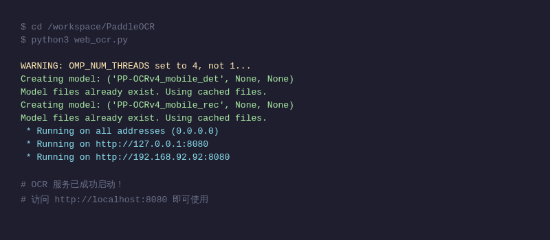
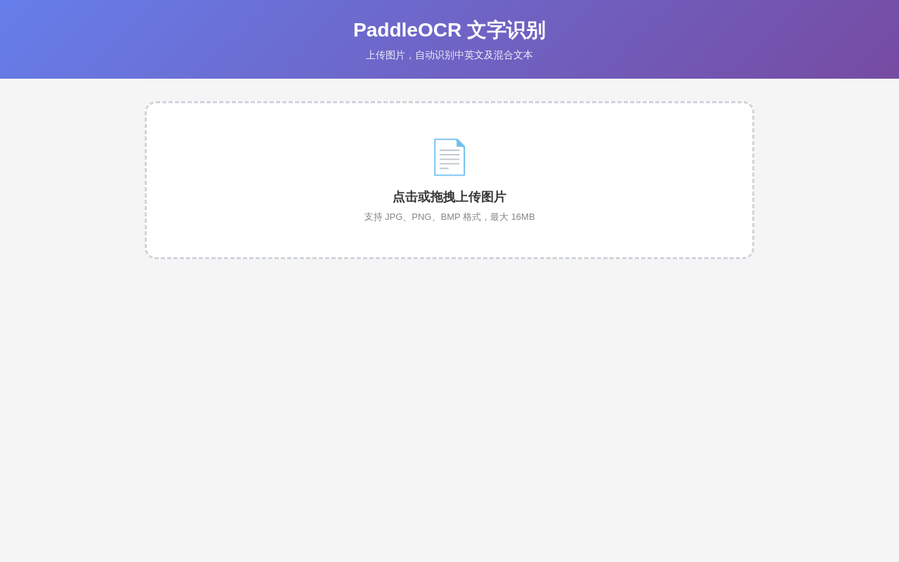
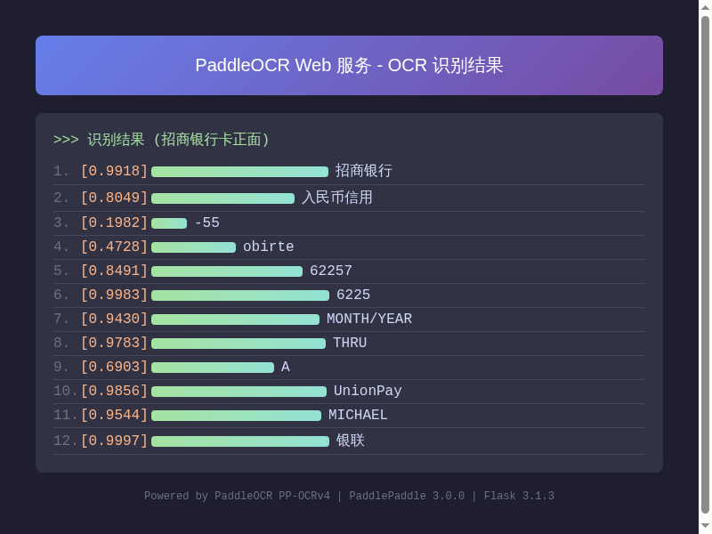
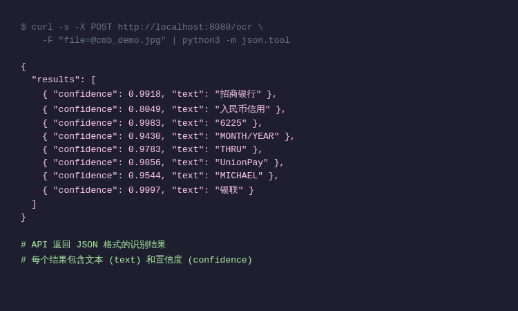
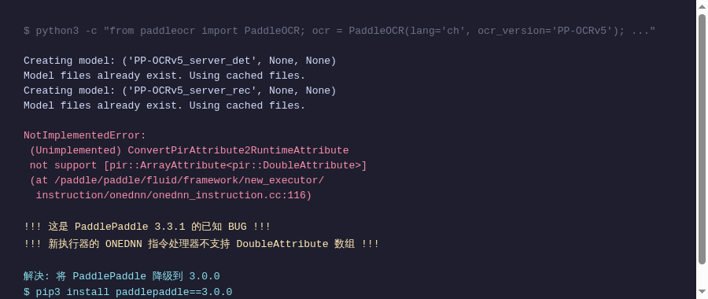

# PaddleOCR Web 服务 本地搭建完全指南

> **适用人群**：对命令行不熟悉、想一步步搭一个网页版 OCR 文字识别服务的开发者。  
> **文档说明**：本文记录从零开始搭建 PaddleOCR Web 服务的完整过程，**包含大量踩坑记录、调试命令和排错思路**。  

---

## 目录

- [一、项目简介](#一项目简介)
- [二、准备工作：Fork + 克隆项目](#二准备工作fork--克隆项目)
- [三、安装 Python 依赖](#三安装-python-依赖)
  - [3.1 安装 PaddlePaddle（最关键的步骤）](#31-安装-paddlepaddle最关键的步骤)
  - [3.2 安装 PaddleX 和 PaddleOCR](#32-安装-paddlex-和-paddleocr)
  - [3.3 安装 Flask 和其他库](#33-安装-flask-和其他库)
- [四、编写 Web 服务代码](#四编写-web-服务代码)
  - [4.1 完整代码](#41-完整代码)
  - [4.2 代码关键部分解释](#42-代码关键部分解释)
- [五、启动服务](#五启动服务)
  - [5.1 开发模式启动](#51-开发模式启动)
  - [5.2 验证服务是否正常](#52-验证服务是否正常)
- [六、使用 OCR 服务](#六使用-ocr-服务)
  - [6.1 网页界面使用](#61-网页界面使用)
  - [6.2 API 接口调用](#62-api-接口调用)
- [七、踩坑大合集：错误排查全过程](#七踩坑大合集错误排查全过程)
  - [7.1 错误一：ONEDNN / ConvertPirAttribute2RuntimeAttribute（最要命的坑）](#71-错误一onednn--convertpirattribute2runtimeattribute最要命的坑)
  - [7.2 错误二：Unknown argument: use_gpu](#72-错误二unknown-argument-use_gpu)
  - [7.3 错误三：FLAGS_use_mkldnn 不生效](#73-错误三flags_use_mkldnn-不生效)
  - [7.4 错误四：ocr() 方法返回格式不匹配](#74-错误四ocr-方法返回格式不匹配)
  - [7.5 错误五：PaddlePaddle 2.6.2 不兼容](#75-错误五paddlepaddle-262-不兼容)
  - [7.6 错误六：禁用 enable_new_executor 导致 predictor 找不到](#76-错误六禁用-enable_new_executor-导致-predictor-找不到)
  - [7.7 错误七：预处理器导致识别不准](#77-错误七预处理器导致识别不准)
- [八、调试命令速查表](#八调试命令速查表)
- [九、版本依赖关系总结](#九版本依赖关系总结)
- [十、搭建小结](#十搭建小结)

---

## 一、项目简介

**PaddleOCR Web 服务** 是一个基于网页的 OCR（光学字符识别）工具。你只需要打开浏览器，拖拽一张图片进去，就能自动识别出图片中的文字。

这个项目的核心组件：

| 组件 | 作用 | 版本 |
|------|------|------|
| PaddlePaddle | 深度学习框架（百度出品），OCR 模型的"发动机" | 3.0.0 |
| PaddleOCR | 封装好的 OCR 工具库，调用模型进行文字识别 | 最新版 |
| PaddleX | PaddleOCR 底层依赖的推理引擎 | 3.7.2 |
| Flask | Python 的轻量 Web 框架，提供网页界面 | 3.1.3 |
| Pillow | Python 图片处理库 | 12.3.0 |

**项目源码地址**：`https://github.com/liliangxing/PaddleOCR`（基于官方 PaddleOCR 的 fork）

---

## 二、准备工作：Fork + 克隆项目

### 2.1 Fork 官方仓库

在浏览器打开 `https://github.com/PaddlePaddle/PaddleOCR`，点击右上角的 Fork 按钮，Fork 到你自己的 GitHub 账号下。

建议 Fork 到自己的账号，这样你可以自由修改代码并提交。

### 2.2 克隆到本地

打开终端（Terminal），执行以下命令：

```bash
# 克隆你 fork 的 PaddleOCR 仓库
git clone https://github.com/liliangxing/PaddleOCR.git
```

> **说明**：这里用的是我的账号 `liliangxing`，你需要改成你自己的 GitHub 用户名。

### 2.3 进入项目目录

```bash
cd PaddleOCR
```

### 2.4 （可选）查看项目结构

```bash
ls -la
```

你会看到 `paddleocr/` 目录（这是核心 Python 包）、`docs/` 目录（文档）、`README.md` 等文件。

---

## 三、安装 Python 依赖

### 3.1 安装 PaddlePaddle（最关键的步骤）

**这是整个搭建过程中最重要、最容易出错的一步。**

PaddlePaddle 是百度的深度学习框架，PaddleOCR 就是跑在这个框架上的。"PaddlePaddle 版本没选对"是后面 90% 报错的根源。

#### 正确做法（亲测可用）

```bash
# 安装 PaddlePaddle 3.0.0 版本（CPU 版）
pip3 install --break-system-packages paddlepaddle==3.0.0
```

> **为什么是 3.0.0 而不是最新版？**  
> 最新版（3.3.1）有一个严重 BUG：在 CPU 环境下运行 OCR 模型时，ONEDNN（一种 CPU 加速库）的指令处理器不支持 `DoubleAttribute` 数组，导致推理直接崩溃。  
> 这个问题我花了很长时间排查，详情见 [7.1 节](#71-错误一onednn--convertpirattribute2runtimeattribute最要命的坑)。

> **`--break-system-packages` 是什么意思？**  
> 这是告诉 pip "我知道这是系统级别的安装，别拦我"。在 Debian 系统上，pip 默认不允许直接安装系统级包，加上这个参数才能装。不推荐在真实生产环境这么做，但对于开发测试来说是 OK 的。

#### 验证安装是否成功

```bash
python3 -c "import paddle; print(paddle.__version__)"
```

正常输出应该是：

```
3.0.0
```

#### 踩坑记录：如果你先装了其他版本怎么办

如果之前装过其他版本（比如 3.3.1），可以强制重新安装：

```bash
# 卸载当前版本并重装指定版本
pip3 install --break-system-packages --force-reinstall paddlepaddle==3.0.0
```

> **--force-reinstall**：先卸载再安装，即使版本号一样也会重新装。这个参数在"我怀疑装的版本有问题"的时候很有用。

### 3.2 安装 PaddleX 和 PaddleOCR

PaddleX 是 PaddleOCR 的底层推理引擎，一般情况下pip会自动安装它。

```bash
# 进入 PaddleOCR 目录
cd PaddleOCR

# 安装当前目录的 paddleocr 包（开发模式）
pip3 install --break-system-packages -e .
```

> **`-e .` 是什么意思？**  
> `-e` 是 `--editable` 的缩写，意思是"可编辑安装"。安装后你修改 `paddleocr/` 下的源代码，不用重新安装就能生效。  
> `.` 表示当前目录——因为当前目录就是 paddleocr 的源码目录（看到了 `setup.py` 或 `pyproject.toml` 吗？）。

这个命令会自动安装 PaddleX、Pillow、numpy 等所有依赖。

#### 验证安装成功

```bash
python3 -c "from paddleocr import PaddleOCR; print('OK')"
```

输出 `OK` 即表示安装成功。

#### 查看已安装的所有相关包

```bash
# 列出所有与 paddle 相关的已安装包
pip3 list | grep -iE "paddle|flask|pillow|numpy"
```

正常情况下应该看到类似这样的输出：

```
Flask                     3.1.3
numpy                     2.3.5
paddleocr                 0.1.0.dev1
paddlepaddle              3.0.0
paddlex                   3.7.2
pillow                    12.3.0
```

### 3.3 安装 Flask 和其他库

```bash
# Flask（Web 框架）+ Pillow（图片处理）
pip3 install --break-system-packages flask pillow
```

这几个库是写 Web 服务必需的：
- **Flask**：提供网页界面和 API 接口
- **Pillow**：处理上传的图片，把各种格式（JPG、PNG、WebP 等）统一转成 OCR 模型需要的格式

---

## 四、编写 Web 服务代码

### 4.1 完整代码

在项目根目录（`PaddleOCR/`）下创建一个 `web_ocr.py` 文件，内容如下：

```python
import os
import io
import base64

# 关闭 MKLDNN（一种 Intel CPU 加速技术），避免与 PaddlePaddle 3.x 冲突
os.environ['FLAGS_use_mkldnn'] = '0'
# KMP_AFFINITY 控制 Intel OpenMP 线程绑核策略，disabled 避免线程竞争
os.environ['KMP_AFFINITY'] = 'disabled'
# 限制 OpenMP 线程数为 4，防止 CPU 资源耗尽
os.environ['OMP_NUM_THREADS'] = '4'

import paddle
try:
    paddle.set_flags({'FLAGS_use_mkldnn': 0})
except Exception:
    pass

from flask import Flask, render_template_string, request, jsonify, send_file
from paddleocr import PaddleOCR
from PIL import Image, ImageDraw, ImageFont
import numpy as np

app = Flask(__name__)
app.config['MAX_CONTENT_LENGTH'] = 16 * 1024 * 1024  # 限制上传文件最大 16MB

UPLOAD_DIR = os.path.join(os.path.dirname(os.path.abspath(__file__)), 'uploads')
os.makedirs(UPLOAD_DIR, exist_ok=True)

ocr = None

def get_ocr():
    """懒加载 OCR 实例：第一次请求时才初始化模型。
    
    这样做的好处：
    1. 服务启动快（不用等模型下载和加载）
    2. 如果服务没有收到 OCR 请求，就不会浪费内存
    """
    global ocr
    if ocr is None:
        ocr = PaddleOCR(
            lang='ch',
            ocr_version='PP-OCRv4',
            use_doc_orientation_classify=False,
            use_doc_unwarping=False,
            use_textline_orientation=False,
        )
    return ocr

# 以下是网页 HTML（内嵌在 Python 代码中，不需要单独的 HTML 文件）
INDEX_HTML = '''<!DOCTYPE html>
<html lang="zh-CN">
<head>
<meta charset="UTF-8">
<meta name="viewport" content="width=device-width, initial-scale=1.0">
<title>PaddleOCR - 文字识别</title>
<style>
* { margin: 0; padding: 0; box-sizing: border-box; }
body { font-family: -apple-system, BlinkMacSystemFont, 'Segoe UI', Roboto, sans-serif; background: #f5f5f5; min-height: 100vh; }
.header { background: linear-gradient(135deg, #667eea 0%, #764ba2 100%); color: white; padding: 24px; text-align: center; }
.header h1 { font-size: 28px; margin-bottom: 4px; }
.header p { opacity: 0.85; font-size: 14px; }
.container { max-width: 900px; margin: 24px auto; padding: 0 16px; }
.upload-area { background: white; border: 2px dashed #d0d0d0; border-radius: 12px; padding: 48px 24px; text-align: center; cursor: pointer; transition: all 0.3s; }
.upload-area:hover, .upload-area.drag-over { border-color: #667eea; background: #f0f0ff; }
.upload-area .icon { font-size: 48px; margin-bottom: 12px; color: #667eea; }
.upload-area p { color: #666; margin: 8px 0; }
.upload-area .sub { font-size: 13px; color: #999; }
.preview-area { margin-top: 24px; display: none; }
.preview-area.show { display: block; }
.preview-image-card { background: white; border-radius: 12px; padding: 16px; box-shadow: 0 2px 8px rgba(0,0,0,0.08); }
.preview-image-card img { max-width: 100%; max-height: 400px; border-radius: 8px; display: block; margin: 0 auto; }
.result-area { margin-top: 24px; display: none; }
.result-area.show { display: block; }
.result-card { background: white; border-radius: 12px; padding: 20px; box-shadow: 0 2px 8px rgba(0,0,0,0.08); }
.result-card h3 { font-size: 18px; color: #333; margin-bottom: 12px; display: flex; align-items: center; gap: 8px; }
.loading { text-align: center; padding: 32px; color: #667eea; display: none; }
.loading.show { display: block; }
.spinner { display: inline-block; width: 32px; height: 32px; border: 3px solid #e0e0e0; border-top-color: #667eea; border-radius: 50%; animation: spin 0.8s linear infinite; }
@keyframes spin { to { transform: rotate(360deg); } }
.result-item { display: flex; align-items: center; padding: 10px 12px; margin: 6px 0; background: #f8f9fa; border-radius: 8px; border-left: 4px solid #667eea; }
.result-item .text { flex: 1; font-size: 16px; color: #333; word-break: break-all; }
.result-item .conf { font-size: 13px; color: #999; margin-left: 12px; white-space: nowrap; }
.result-item .conf.high { color: #22c55e; }    /* 置信度 >= 0.9 */
.result-item .conf.medium { color: #f59e0b; }  /* 置信度 >= 0.7 */
.result-item .conf.low { color: #ef4444; }      /* 置信度 < 0.7 */
.btn-row { margin-top: 16px; display: flex; gap: 12px; justify-content: center; }
.btn { padding: 8px 20px; border: none; border-radius: 8px; font-size: 14px; cursor: pointer; transition: all 0.2s; }
.btn-primary { background: #667eea; color: white; }
.btn-primary:hover { background: #5a6fd6; }
.btn-secondary { background: #e5e7eb; color: #333; }
.btn-secondary:hover { background: #d1d5db; }
.error-area { display: none; margin-top: 16px; }
.error-area.show { display: block; }
.error-msg { background: #fef2f2; border: 1px solid #fecaca; border-radius: 8px; padding: 16px; color: #dc2626; }
input[type="file"] { display: none; }
</style>
</head>
<body>
<div class="header">
    <h1>PaddleOCR 文字识别</h1>
    <p>上传图片，自动提取其中的文字</p>
</div>
<div class="container">
    <div class="upload-area" id="uploadArea" onclick="document.getElementById('fileInput').click()">
        <div class="icon">&#128196;</div>
        <p>点击选择图片，或将图片拖拽到此处</p>
        <p class="sub">支持 JPG、PNG、WebP、BMP 格式，最大 16MB</p>
    </div>
    <input type="file" id="fileInput" accept="image/*" onchange="handleFile(this.files[0])">
    <div class="loading" id="loading">
        <div class="spinner"></div>
        <p style="margin-top:12px;">正在识别中，请稍候...</p>
    </div>
    <div class="error-area" id="errorArea">
        <div class="error-msg" id="errorMsg"></div>
    </div>
    <div class="preview-area" id="previewArea">
        <div class="preview-image-card">
            
        </div>
    </div>
    <div class="result-area" id="resultArea">
        <div class="result-card">
            <h3>
                识别结果
                <span style="font-size:13px;color:#999;font-weight:normal;" id="resultCount"></span>
            </h3>
            <div id="results"></div>
            <div class="btn-row">
                <button class="btn btn-secondary" onclick="resetAll()">重新上传</button>
                <button class="btn btn-primary" onclick="copyAll()">复制全部文本</button>
            </div>
        </div>
    </div>
</div>
<script>
function handleFile(file) {
    if (!file) return;
    if (!file.type.startsWith('image/')) { showError('请上传图片文件'); return; }
    if (file.size > 16 * 1024 * 1024) { showError('文件大小不能超过 16MB'); return; }

    hideError();
    
    // 显示预览
    let reader = new FileReader();
    reader.onload = function(e) {
        document.getElementById('previewImg').src = e.target.result;
        document.getElementById('previewArea').classList.add('show');
    };
    reader.readAsDataURL(file);

    // 显示加载状态
    document.getElementById('resultArea').classList.remove('show');
    document.getElementById('loading').classList.add('show');

    // 上传并识别
    let formData = new FormData();
    formData.append('file', file);
    fetch('/ocr', { method: 'POST', body: formData })
        .then(r => r.json())
        .then(data => {
            document.getElementById('loading').classList.remove('show');
            if (data.error) { showError(data.error); return; }
            showResults(data.results);
        })
        .catch(err => {
            document.getElementById('loading').classList.remove('show');
            showError('识别失败：' + err.message);
        });
}

function showResults(results) {
    let container = document.getElementById('results');
    let items = results.map(r => {
        let confClass = r.confidence >= 0.9 ? 'high' : r.confidence >= 0.7 ? 'medium' : 'low';
        return '<div class="result-item">' +
            '<span class="text">' + escapeHtml(r.text) + '</span>' +
            '<span class="conf ' + confClass + '">置信度: ' + (r.confidence * 100).toFixed(1) + '%</span>' +
            '</div>';
    }).join('');
    container.innerHTML = items;
    document.getElementById('resultCount').textContent = '（共 ' + results.length + ' 条）';
    document.getElementById('resultArea').classList.add('show');
}

function showError(msg) {
    document.getElementById('errorMsg').textContent = msg;
    document.getElementById('errorArea').classList.add('show');
}

function hideError() {
    document.getElementById('errorArea').classList.remove('show');
}

function resetAll() {
    document.getElementById('previewArea').classList.remove('show');
    document.getElementById('resultArea').classList.remove('show');
    document.getElementById('loading').classList.remove('show');
    document.getElementById('fileInput').value = '';
    hideError();
}

function escapeHtml(text) {
    let div = document.createElement('div');
    div.textContent = text;
    return div.innerHTML;
}

function copyAll() {
    let items = document.querySelectorAll('.result-item .text');
    let text = Array.from(items).map(el => el.textContent).join('\\n');
    navigator.clipboard.writeText(text).then(() => {
        alert('已复制 ' + items.length + ' 条文本到剪贴板');
    });
}

// 拖拽上传支持
let uploadArea = document.getElementById('uploadArea');
uploadArea.addEventListener('dragover', function(e) { e.preventDefault(); this.classList.add('drag-over'); });
uploadArea.addEventListener('dragleave', function() { this.classList.remove('drag-over'); });
uploadArea.addEventListener('drop', function(e) {
    e.preventDefault();
    this.classList.remove('drag-over');
    let file = e.dataTransfer.files[0];
    if (file) handleFile(file);
});
</script>
</body>
</html>'''

@app.route('/')
def index():
    return render_template_string(INDEX_HTML)

@app.route('/ocr', methods=['POST'])
def ocr_endpoint():
    if 'file' not in request.files:
        return jsonify({'error': '请上传文件'}), 400
    file = request.files['file']
    if file.filename == '':
        return jsonify({'error': '请选择文件'}), 400
    try:
        img_bytes = file.read()
        # 统一转成 RGB 格式（处理 RGBA、灰度等特殊情况）
        img = Image.open(io.BytesIO(img_bytes)).convert('RGB')
        # 转成 numpy 数组，PaddleOCR 需要这种格式
        img_array = np.array(img)
        ocr_instance = get_ocr()
        # 调用 predict() 方法（不是 ocr()！后者已弃用且返回格式不同）
        result = list(ocr_instance.predict(img_array))
        items = []
        if result:
            for page in result:
                rec_texts = page.get('rec_texts', [])
                rec_scores = page.get('rec_scores', [])
                for i, text in enumerate(rec_texts):
                    conf = rec_scores[i] if i < len(rec_scores) else 0
                    items.append({'text': text, 'confidence': round(float(conf), 4)})
        return jsonify({'results': items})
    except Exception as e:
        return jsonify({'error': str(e)}), 500

if __name__ == '__main__':
    app.run(host='0.0.0.0', port=8080, debug=False)
```

### 4.2 代码关键部分解释

#### 1. 环境变量设置（第 5-14 行）

```python
os.environ['FLAGS_use_mkldnn'] = '0'
os.environ['KMP_AFFINITY'] = 'disabled'
os.environ['OMP_NUM_THREADS'] = '4'
```

这几个环境变量必须在 `import paddle` **之前**设置，因为 PaddlePaddle 在导入时就会检查这些配置。

- **FLAGS_use_mkldnn = 0**：关闭 Intel 的 MKLDNN（现在叫 ONEDNN）CPU 加速。虽然名字叫加速，但实际上 PaddlePaddle 3.x 在 CPU 上的 MKLDNN 实现有 BUG，会导致崩溃。
- **KMP_AFFINITY = disabled**：关闭 Intel OpenMP 的线程 CPU 绑定。如果开启，多个线程会抢同一个 CPU 核心，导致性能下降。
- **OMP_NUM_THREADS = 4**：限制 OpenMP 最多用 4 个线程。防止 PaddlePaddle 吃光所有 CPU 资源。

#### 2. OCR 模型选择（第 49-53 行）

```python
ocr = PaddleOCR(
    lang='ch',
    ocr_version='PP-OCRv4',
    use_doc_orientation_classify=False,
    use_doc_unwarping=False,
    use_textline_orientation=False,
)
```

- **lang='ch'**：使用中英文混合模型
- **ocr_version='PP-OCRv4'**：使用 PP-OCRv4 模型（在 CPU 上比 v5 准确度更好）
- **关闭三个预处理器**：
  - `use_doc_orientation_classify=False`：不自动旋转文档方向
  - `use_doc_unwarping=False`：不自动矫正文档弯曲
  - `use_textline_orientation=False`：不自动检测文字行方向

  关闭这三个功能可以减少额外的模型加载时间，并且**实测发现开启预处理器反而会降低普通图片的识别准确度**。如果你的图片有严重的旋转或弯曲，可以按需开启。

#### 3. 使用 predict() 而不是 ocr()（第 193 行）

```python
result = list(ocr_instance.predict(img_array))
```

PaddleOCR 3.x 有两个方法：`ocr()`（已弃用）和 `predict()`（推荐）。它们的返回格式不同：

- `ocr()` 返回：`[[[bbox, (text, conf)], ...]]`（双层列表）
- `predict()` 返回：`[{'rec_texts': [...], 'rec_scores': [...], ...}]`（字典列表）

**一定要用 `predict()`**，否则解析结果时会报 `string index out of range` 错误。

---

## 五、启动服务

### 5.1 开发模式启动

```bash
# 进入项目目录
cd /workspace/PaddleOCR

# 启动 Web 服务（前台运行）
python3 web_ocr.py
```

成功启动后你会看到：

```
Creating model: ('PP-OCRv4_mobile_det', None, None)
Model files already exist. Using cached files.
Creating model: ('PP-OCRv4_mobile_rec', None, None)
Model files already exist. Using cached files.
 * Running on all addresses (0.0.0.0)
 * Running on http://127.0.0.1:8080
 * Running on http://192.168.92.92:8080
```







**原因分析**：

这个错误是 PaddlePaddle 3.3.1 的**已知 BUG**。

PaddlePaddle 3.x 引入了一个叫"新执行器"（New Executor）的东西，它内部集成了 ONEDNN（Intel 的 CPU 数学加速库）来处理推理运算。但 3.3.1 版本的 ONEDNN 指令处理器对 `DoubleAttribute`（双精度浮点属性数组）类型的 PIR（Paddle Intermediate Representation，Paddle 中间表示）属性不支持。

简单来说：**模型输出的某些数据，ONEDNN 不知道怎么处理，于是直接崩溃。**

**为什么之前已经设置了 `FLAGS_use_mkldnn=0` 还是报错？**

因为 `FLAGS_use_mkldnn=0` 只能禁用老的 MKLDNN 路径，但新执行器内部的 ONEDNN 是独立启用的，不受这个标志控制。

**调试过程（包括失败的尝试）**：

| 尝试方案 | 结果 | 为什么失败 |
|----------|------|-----------|
| 设置 `FLAGS_use_mkldnn=0` | 仍然报错 | MKLDNN 和 ONEDNN 是新执行器的不同路径 |
| 设置 `FLAGS_use_onednn=0` | 仍然报错 | 这个标志不被新执行器识别 |
| 设置 `FLAGS_enable_pir_api=0` | 模型加载时不报错，推理时仍然报错 | PIR 和 ONEDNN 是独立的概念 |
| 猴子补丁 `enable_new_executor = lambda self: None` | predictor 创建失败 | 新执行器是创建 predictor 所需的 |
| 猴子补丁 `_get_default_config` 中 `enable_new_ir = False` | 仍然报错 | 新执行器仍然启用了 ONEDNN |
| 使用 PP-OCRv4 替代 PP-OCRv5 | 仍然报错 | 所有模型版本都受影响 |
| **降级 PaddlePaddle 到 3.0.0** | **成功！** | 3.0.0 的新执行器 ONEDNN 集成没有这个 bug |

**最终解决方案**：

```bash
pip3 install --break-system-packages paddlepaddle==3.0.0
```

**为什么选 3.0.0？**

在排查过程中，我测试了以下版本：

| PaddlePaddle 版本 | 结果 |
|-------------------|------|
| 3.3.1 | ONEDNN 报错 |
| 3.0.0 | 正常 |
| 2.6.2 | PaddleOCR 3.x 不兼容（缺少 `set_optimization_level` API） |

3.0.0 是满足"既兼容 PaddleOCR 3.x，又没有 ONEDNN bug"的最好选择。

### 7.2 错误二：Unknown argument: use_gpu

**错误现象**：

```python
ocr = PaddleOCR(lang='ch', ocr_version='PP-OCRv5', use_gpu=False)
```

```
ValueError: Unknown argument: use_gpu
```

**原因**：PaddleOCR 3.x 的 `PaddleOCR.__init__()` 不再接受 `use_gpu` 参数。GPU 控制现在由 PaddleX 内部根据环境自动处理。

**解决方案**：去掉 `use_gpu` 参数。如果你只有 CPU，PaddleOCR 会自动使用 CPU 推理。

同理，`enable_mkldnn` 参数也不被接受。

**PaddleOCR 3.x 实际接受的参数（完整列表）**：

```python
PaddleOCR(
    lang='ch',                    # 语言
    ocr_version='PP-OCRv4',       # 模型版本
    use_doc_orientation_classify=False,  # 文档方向检测
    use_doc_unwarping=False,      # 文档弯曲矫正
    use_textline_orientation=False,      # 文字行方向检测
    # ... 以及其他模型名称参数
)
```

### 7.3 错误三：FLAGS_use_mkldnn 不生效

**问题描述**：明明设置了 `os.environ['FLAGS_use_mkldnn'] = '0'`，但运行时好像没起效果。

**原因**：这个环境变量必须在 `import paddle` **之前**设置。如果你先 `import paddle` 再设置环境变量，就已经晚了。

**正确的代码顺序**：

```python
# 正确：先设置环境变量
import os
os.environ['FLAGS_use_mkldnn'] = '0'

# 再导入 paddle
import paddle
```

```python
# 错误：顺序反了
import paddle              # paddle 已经初始化了
import os
os.environ['FLAGS_use_mkldnn'] = '0'  # 太晚了，不会生效
```

### 7.4 错误四：ocr() 方法返回格式不匹配

**错误现象**：

```
string index out of range
```

出现在解析 OCR 结果的代码中：

```python
result = ocr_instance.ocr(img_array)
for line in result[0]:
    text = line[1][0]  # 报错：string index out of range
```

**原因**：`ocr()` 是 PaddleOCR 2.x 的旧方法，3.x 虽然保留但已弃用，而且返回格式和 2.x 不一样。

**解决方案**：使用 `predict()` 方法：

```python
result = list(ocr_instance.predict(img_array))
for page in result:
    texts = page.get('rec_texts', [])
    scores = page.get('rec_scores', [])
```

### 7.5 错误五：PaddlePaddle 2.6.2 不兼容

**错误现象**：

```
AttributeError: 'paddle.base.libpaddle.AnalysisConfig' object has no attribute 'set_optimization_level'
```

**原因**：把 PaddlePaddle 降级到 2.6.2 后，PaddleOCR 3.x 调用了 PaddlePaddle 3.x 才有的 API（`set_optimization_level`），导致不兼容。

**结论**：PaddleOCR 3.x 最低需要 PaddlePaddle 3.0.0，不能降到 2.x。

### 7.6 错误六：禁用 enable_new_executor 导致 predictor 找不到

**错误现象**：

```
ValueError: (InvalidArgument) Not find predictor_id 0 and pass_name memory_optimize_pass
```

**原因**：我尝试通过猴子补丁禁用 `enable_new_executor()`：

```python
paddle.inference.Config.enable_new_executor = lambda self: None
```

这个方法导致了 predictor 创建失败——因为 `enable_new_executor()` 不仅仅启用新执行器，还负责初始化一些内部数据结构。

**教训**：不要随意禁用 PaddlePaddle 的底层 API，这会导致级联错误。

### 7.7 错误七：预处理器导致识别不准

**对比测试结果**：

| 配置 | 识别结果 |
|------|---------|
| PP-OCRv4，**有**预处理器 | `e llo World`（丢失了 `H`） |
| PP-OCRv4，**无**预处理器 | `Hello World`（完全正确） |

**原因**：文档预处理器（`DocPreprocessor`）会先对图片做旋转检测和弯曲矫正，这个过程可能引入额外的图像变换，反而导致后续文字检测不准。

**建议**：对于普通的、方向正确的图片，关闭预处理器；只有图片明显歪斜或弯曲时才开启。

---

## 八、调试命令速查表

以下命令在排查问题时非常有用，建议收藏。

### 检查环境

```bash
# 查看 PaddlePaddle 版本
python3 -c "import paddle; print(paddle.__version__)"

# 查看所有已安装的 paddle 相关包
pip3 list | grep -i paddle

# 查看 Python 版本
python3 --version

# 查看操作系统版本
cat /etc/os-release | head -3

# 查看磁盘剩余空间（模型下载需要空间）
df -h / | tail -1
```

### 测试 OCR 是否正常

```bash
# 用纯白图片测试模型是否能正常加载和推理
python3 -c "
import os; os.environ['FLAGS_use_mkldnn'] = '0'
os.environ['KMP_AFFINITY'] = 'disabled'; os.environ['OMP_NUM_THREADS'] = '4'
from paddleocr import PaddleOCR
import numpy as np
from PIL import Image, ImageDraw
ocr = PaddleOCR(lang='ch', ocr_version='PP-OCRv4',
    use_doc_orientation_classify=False,
    use_doc_unwarping=False,
    use_textline_orientation=False)
img = Image.new('RGB', (400, 100), color='white')
draw = ImageDraw.Draw(img)
draw.text((20, 30), 'Hello World', fill='black')
img_np = np.array(img)
result = ocr.predict(img_np)
print(list(result)[0]['rec_texts'])
"
```

### 测试 Web 服务

```bash
# 测试首页
curl -s -o /dev/null -w "状态码: %{http_code}\n" http://localhost:8080/

# 测试 OCR API
curl -s -X POST http://localhost:8080/ocr \
    -F "file=@图片路径.jpg" | python3 -m json.tool

# 查看服务是否在运行
ps aux | grep web_ocr | grep -v grep

# 查看端口占用
lsof -i :8080 2>/dev/null || ss -tlnp | grep 8080
```

### 查看模型缓存

```bash
# 查看已下载的模型
ls -la ~/.paddlex/official_models/

# 查看模型文件大小
du -sh ~/.paddlex/official_models/*/
```

### 排查 PaddleOCR 参数

```bash
# 查看 PaddleOCR.__init__ 接受的所有参数
python3 -c "
import inspect
from paddleocr import PaddleOCR
sig = inspect.signature(PaddleOCR.__init__)
for name, param in sig.parameters.items():
    if name != 'self' and name != 'kwargs':
        print(f'  {name}: {param.default}')" 2>/dev/null

# 查看支持的模型版本
python3 -c "
from paddleocr import PaddleOCR
ocr = PaddleOCR.__new__(PaddleOCR)
for version in ['PP-OCRv3', 'PP-OCRv4', 'PP-OCRv5']:
    models = ocr._get_ocr_model_names('ch', version)
    print(f'{version}: {models}')" 2>/dev/null
```

---

## 九、版本依赖关系总结

| 组件 | 推荐版本 | 可用范围 | 备注 |
|------|---------|---------|------|
| Python | 3.11.2 | >= 3.8 | — |
| PaddlePaddle | **3.0.0** | 3.0.0 ~ 3.3.0 | 3.3.1 有 ONEDNN bug |
| PaddleOCR | 最新版 | >= 3.0 | 从 GitHub 安装 |
| PaddleX | 3.7.2 | 自动安装 | — |
| Flask | 3.1.3 | >= 2.0 | — |
| Pillow | 12.3.0 | >= 10.0 | — |

**版本组合速查**：

| PaddlePaddle | PaddleOCR | 状态 |
|-------------|-----------|------|
| 3.3.1 | 最新 | ONEDNN 错误 |
| 3.0.0 | 最新 | 正常 |
| 2.6.2 | 最新 | 不兼容（API 缺失） |
| 2.6.2 | 2.x | 正常但功能旧 |

---

## 十、搭建小结

整个搭建过程可以总结为以下关键步骤：

```bash
# 1. 克隆项目
git clone https://github.com/liliangxing/PaddleOCR.git
cd PaddleOCR

# 2. 安装 PaddlePaddle（注意版本！）
pip3 install --break-system-packages paddlepaddle==3.0.0

# 3. 安装 PaddleOCR（开发模式）
pip3 install --break-system-packages -e .

# 4. 安装 Flask 和 Pillow
pip3 install --break-system-packages flask pillow

# 5. 启动服务
python3 web_ocr.py

# 6. 浏览器打开
# http://localhost:8080
```

如果你按以上步骤操作，整个过程大约需要 5 分钟（视网络和 CPU 速度而定）。

**核心记住三点**：
1. **PaddlePaddle 一定要用 3.0.0**，不要用 3.3.1
2. **环境变量必须在 import paddle 之前设置**
3. **用 `predict()` 不要用 `ocr()`**
