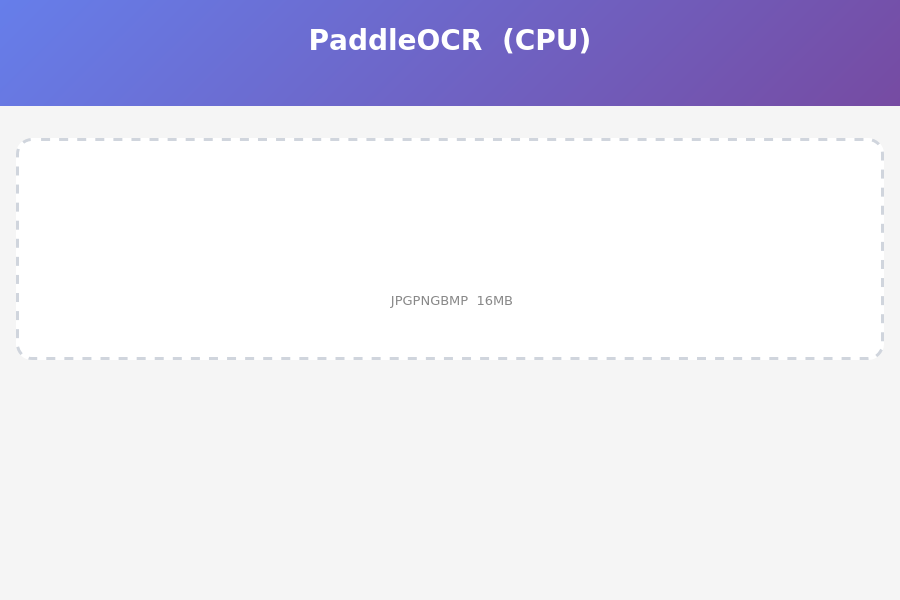
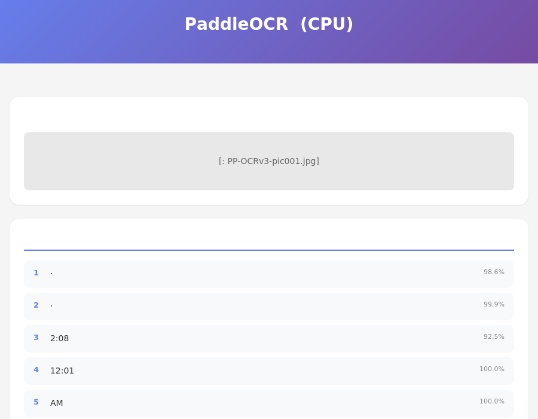

# PaddleOCR PP-OCRv6 Web 服务搭建完整指南

> 适用环境：Linux (Debian/Ubuntu)，Python 3.11，CPU 推理

---

## 一、概述

本文档记录了在 CPU 环境下，从零搭建 PaddleOCR PP-OCRv6 Web 文字识别服务的完整过程。包括依赖安装、踩坑记录、模型验证和 Web 服务部署。

最终效果：一个 Web 页面，上传图片后自动识别图片中的文字。





---

## 二、环境准备

### 2.1 克隆项目并回退到指定版本

```bash
# 克隆 PaddleOCR 项目
git clone https://github.com/PaddlePaddle/PaddleOCR.git
cd PaddleOCR

# 回退到指定提交（使用 PP-OCRv6 支持的版本）
git reset --hard 211989f046cc1878460f9e65574690c00a127a1a
```

### 2.2 安装系统依赖

PaddleOCR 依赖 OpenCV，而 OpenCV 又依赖一些系统图形库。**如果不装这些库，导入 cv2 就会报错。**

```bash
# 更新 apt 软件包列表（很多新环境需要先跑这一步）
apt-get update

# 安装 OpenGL 支持库（OpenCV 读取图片需要）
# 如果不装，报错：libGL.so.1: cannot open shared object file
apt-get install -y libgl1-mesa-glx

# 安装 GLib 库（OpenCV 内部线程管理需要）
# 如果不装，报错：libgthread-2.0.so.0: cannot open shared object file
apt-get install -y libglib2.0-0
```

**为什么需要这两个系统库？**

- `libgl1-mesa-glx`：OpenCV 的 `cv2` 模块在初始化时会尝试加载 OpenGL 库来渲染图像窗口。即使你不显示窗口，它也会尝试加载。`opencv-python-headless`（无头版）不依赖这个，但 PaddleOCR 依赖的是标准版 `opencv-contrib-python`。
- `libglib2.0-0`：OpenCV 4.x 版本内部使用 GLib 的事件循环来处理一些异步操作，所以需要 `libgthread` 这个 GLib 线程扩展。

### 2.3 安装 Python 依赖

```bash
# 以开发模式安装 PaddleOCR（从本地源码安装）
# 这会自动拉取 paddlex、paddlepaddle 等依赖
pip install -e .

# 安装 PaddlePaddle 深度学习框架
pip install paddlepaddle>=3.0.0

# 安装 Web 服务相关依赖
pip install flask flask-cors pillow numpy waitress
```

**安装后确认版本：**

```bash
# 查看 PaddlePaddle 版本
python3 -c "import paddle; print(paddle.__version__)"
# 输出：3.3.1

# 查看 PaddleOCR 版本
pip show paddleocr | grep Version
```

---

## 三、踩坑记录（按遇到顺序）

### 坑 1：opencv-contrib-python 缺少 libGL

**现象：**
```
ImportError: libGL.so.1: cannot open shared object file: No such file or directory
```

**原因：** PaddleOCR 依赖 `opencv-contrib-python`，这个包需要系统的 OpenGL 库才能工作。

**解决：**
```bash
apt-get install -y libgl1-mesa-glx
```

**补充说明：** 不能用 `opencv-python-headless` 替代，因为 paddlex 的依赖检查会精确比对包名，只认 `opencv-contrib-python`，不认 headless 版本。

---

### 坑 2：opencv-contrib-python 缺少 libgthread

**现象：**
```
ImportError: libgthread-2.0.so.0: cannot open shared object file: No such file or directory
```

**原因：** OpenCV 4.10 版本的 Python 绑定需要 GLib 线程库。

**解决：**
```bash
apt-get install -y libglib2.0-0
```

---

### 坑 3：MKLDNN / ONEDNN PIR 转换错误（最关键的坑）

**现象：**
```
NotImplementedError: ConvertPirAttribute2RuntimeAttribute not support 
[pir::ArrayAttribute<pir::DoubleAttribute>]
(at paddle/fluid/framework/new_executor/instruction/onednn/onednn_instruction.cc:116)
```

**原因：** PaddlePaddle 3.x 在 CPU 上默认启用 MKLDNN（也叫 ONEDNN，是一种利用 Intel CPU 特殊指令集加速计算的引擎）。但是 Paddle 3.x 的 PIR（Paddle Intermediate Representation，新版中间表示）和 ONEDNN 之间存在兼容性 bug，导致某些模型转换失败。

**解决：** 在导入 PaddleOCR 之前，设置三个环境变量来彻底禁用 MKLDNN：

```python
import os

# 核心配置：告诉 Paddle 不要用 MKLDNN
os.environ['FLAGS_use_mkldnn'] = '0'

# 告诉 PaddleX 框架默认不要启用 MKLDNN
os.environ['PADDLE_PDX_ENABLE_MKLDNN_BYDEFAULT'] = 'False'

# 避免 CPU 线程绑定导致的调度问题
os.environ['KMP_AFFINITY'] = 'disabled'
```

**注意：** 这些环境变量必须在 `import paddleocr` 之前设置，因为 paddleocr 的 `__init__.py` 会直接导入 paddlex，paddlex 又导入 paddle，而 paddle 在导入时就会读取这些环境变量。如果设置晚了，MKLDNN 已经被初始化，再改就来不及了。

完整的导入顺序应该是：

```python
# 1. 先设置环境变量
import os
os.environ['FLAGS_use_mkldnn'] = '0'
os.environ['PADDLE_PDX_ENABLE_MKLDNN_BYDEFAULT'] = 'False'
os.environ['KMP_AFFINITY'] = 'disabled'

# 2. 再导入 paddleocr
from paddleocr import PaddleOCR

# 3. 额外保险：如果 paddle 已经导入了，再设置一次标志
import paddle
try:
    paddle.set_flags({'FLAGS_use_mkldnn': 0})
except Exception:
    pass
```

---

### 坑 4：CORS 跨域导致的 "Failed to fetch"

**现象：** 浏览器打开 Web 页面后，上传图片点击识别，报错"识别失败: Failed to fetch"。

**原因：** 当通过 HTTPS 预览代理访问后端 HTTP 服务时，浏览器会认为这是跨域请求。Flask 默认不返回 CORS 头，浏览器安全策略会阻止 JavaScript 读取响应数据。

**解决：** 安装并启用 flask-cors：

```bash
pip install flask-cors
```

在 `web_ocr.py` 中：

```python
from flask_cors import CORS

app = Flask(__name__)
CORS(app)  # 允许所有来源的跨域请求
```

**补充：** 即使前端和后端在同一个域名下（通过代理），某些代理配置也可能导致浏览器判定为跨域。加了 CORS 是双保险。

---

### 坑 5：Flask 开发服务器性能问题

**现象：** 多人同时上传图片时，服务响应缓慢或超时。

**原因：** Flask 自带的 Werkzeug 开发服务器默认是单线程的，一次只能处理一个请求。OCR 推理耗时 6-10 秒，这期间其他请求会被阻塞。

**解决：** 使用 Waitress 生产级 WSGI 服务器（多线程）：

```bash
# 安装
pip install waitress

# 启动（--prod 参数切换到 Waitress 模式）
python3 web_ocr.py --port 8080 --model small --prod
```

Waitress 默认线程数等于 OMP_NUM_THREADS（我们设置在 2-8 之间），支持并发处理多个 OCR 请求。

---

## 四、验证 PP-OCRv6 是否可用

在启动 Web 服务之前，先写一个简单脚本验证 PP-OCRv6 模型能否正常加载和推理。

### 4.1 创建验证脚本

```bash
cat > test_v6.py << 'EOF'
import os
os.environ['FLAGS_use_mkldnn'] = '0'
os.environ['KMP_AFFINITY'] = 'disabled'
os.environ['PADDLE_PDX_ENABLE_MKLDNN_BYDEFAULT'] = 'False'

import time
from paddleocr import PaddleOCR
import paddle

try:
    paddle.set_flags({'FLAGS_use_mkldnn': 0})
except Exception:
    pass

print("Loading PP-OCRv6 medium model...")
start = time.time()

ocr = PaddleOCR(
    ocr_version="PP-OCRv6",
    lang="ch",
    use_doc_orientation_classify=False,
    use_doc_unwarping=False,
    use_textline_orientation=False,
)

elapsed = time.time() - start
print(f"Model loaded in {elapsed:.1f}s")

print("\nRunning OCR on test image...")
start = time.time()

test_img = "docs/images/PP-OCRv3-pic001.jpg"
result = list(ocr.predict(test_img))

elapsed = time.time() - start
print(f"OCR completed in {elapsed:.1f}s")

for page in result:
    rec_texts = page.get('rec_texts', [])
    rec_scores = page.get('rec_scores', [])
    print(f"\nDetected {len(rec_texts)} text regions:")
    for i, (text, score) in enumerate(zip(rec_texts, rec_scores)):
        print(f"  [{i+1}] {text} ({score:.4f})")

print("\nPP-OCRv6 test PASSED")
EOF
```

### 4.2 运行验证

```bash
python3 test_v6.py
```

**成功输出示例：**
```
Creating model: ('PP-OCRv6_medium_det', None, None)
Model files already exist. Using cached files.
Creating model: ('PP-OCRv6_medium_rec', None, None)
Model files already exist. Using cached files.
Loading PP-OCRv6 medium model...
Model loaded in 17.2s

Running OCR on test image...
OCR completed in 74.2s

Detected 9 text regions:
  [1] 張家·尚品 (0.9751)
  [2] 张家·尚品 (0.9996)
  [3] 12:01 (0.9940)
  [4] TIME (1.0000)
  [5] 12:01 (0.9996)
  [6] AM (1.0000)
  [7] AM (0.9996)
  [8] I/TUE/28 (0.9322)
  [9] 1/ 1/TUE/ 285 (0.9992)

PP-OCRv6 test PASSED
```

**说明：**

- 首次运行时模型会自动下载到 `/root/.paddlex/official_models/` 目录
- medium 模型（34.5M 参数）在 CPU 上推理耗时约 74 秒，精度最高
- small 模型（7.7M 参数）约 6-10 秒，精度足够日常使用
- tiny 模型（1.5M 参数）最快，适合预览或极低配机器

---

## 五、启动 Web 服务

### 5.1 服务文件 web_ocr.py

项目根目录下的 `web_ocr.py` 是 Web 服务的全部代码。核心功能：

| 功能 | 说明 |
|------|------|
| Web UI | 拖拽上传图片，显示识别结果 |
| API 接口 | `POST /ocr` 上传图片，返回 JSON 识别结果 |
| 模型选择 | `--model tiny/small/medium` 三档切换 |
| 服务模式 | `--prod` 切换 Waitress 多线程生产模式 |

### 5.2 启动命令

```bash
# 开发测试（自己用，追求高精度）
python3 web_ocr.py --port 8080 --model medium

# 推荐配置（多人用，速度与精度平衡）
python3 web_ocr.py --port 8080 --model small --prod

# 极速模式（树莓派或极低配机器）
python3 web_ocr.py --port 8080 --model tiny --prod
```

### 5.3 验证服务

```bash
# 验证首页可访问
curl -s -o /dev/null -w "%{http_code}" http://localhost:8080/
# 期望输出：200

# 验证 OCR 接口
curl -s -X POST -F "file=@docs/images/PP-OCRv3-pic001.jpg" http://localhost:8080/ocr
# 期望输出：JSON 格式的识别结果
```

**成功返回示例：**
```json
{
    "results": [
        {"confidence": 0.9864, "text": "张家·尚品"},
        {"confidence": 0.9989, "text": "张家·尚品"},
        {"confidence": 0.9247, "text": "2:08"},
        {"confidence": 0.9999, "text": "12:01"},
        {"confidence": 0.9995, "text": "AM"},
        {"confidence": 0.9666, "text": "1/TUE/285"},
        {"confidence": 0.9895, "text": "1/ 1/TUE/ 285"}
    ]
}
```

---

## 六、完整操作流程（从头到尾）

以下是从零开始搭建并验证的完整命令流水线：

```bash
# ====== 步骤 1：克隆项目 ======
git clone https://github.com/PaddlePaddle/PaddleOCR.git
cd PaddleOCR
git reset --hard 211989f046cc1878460f9e65574690c00a127a1a

# ====== 步骤 2：安装系统依赖 ======
apt-get update
apt-get install -y libgl1-mesa-glx libglib2.0-0

# ====== 步骤 3：安装 Python 依赖 ======
pip install -e .
pip install paddlepaddle>=3.0.0
pip install flask flask-cors pillow numpy waitress

# ====== 步骤 4：验证 PP-OCRv6（首次会下载模型，需等待）=======
python3 test_v6.py

# ====== 步骤 5：启动 Web 服务 ======
python3 web_ocr.py --port 8080 --model small --prod

# ====== 步骤 6：验证服务 ======
curl -s -X POST -F "file=@docs/images/PP-OCRv3-pic001.jpg" http://localhost:8080/ocr
```

---

## 七、常见问题排查

### 问题 1：模型下载失败或超时

网络不稳定时，模型下载可能超时。可以设置环境变量跳过连接检查：

```bash
export PADDLE_PDX_DISABLE_MODEL_SOURCE_CHECK=True
```

### 问题 2：推理速度太慢

- 换用 small 或 tiny 模型
- 确认环境变量 `OMP_NUM_THREADS` 设置合理（min(CPU核数, 8)）
- 确认 MKLDNN 已禁用（如果不禁用会报错，不会慢）

### 问题 3：浏览器显示"Failed to fetch"

逐步排查：

```bash
# 1. 确认服务正在运行
curl http://localhost:8080/

# 2. 确认 API 接口正常
curl -X POST -F "file=@docs/images/PP-OCRv3-pic001.jpg" http://localhost:8080/ocr

# 3. 确认 CORS 已启用（查看响应头中有 Access-Control-Allow-Origin）
curl -I -X OPTIONS -H "Origin: https://example.com" http://localhost:8080/ocr

# 4. 如果都正常，强制刷新浏览器（Ctrl+Shift+R）
```

### 问题 4：端口被占用

```bash
# 查看端口占用
lsof -i :8080

# 换个端口启动
python3 web_ocr.py --port 8081 --model small --prod
```

### 问题 5：识别结果中文字符显示为乱码

确认模型初始化时使用 `lang='ch'` 或 `ocr_version='PP-OCRv6'`，不要混用错误的 lang 参数。

---

## 八、三档模型对比

| 模型 | 参数量 | 推理速度(small) | 精度 | 适用场景 |
|------|--------|----------------|------|---------|
| medium | 34.5M | ~74s | 最高 | 对精度要求高的场景 |
| small | 7.7M | ~6-10s | 良好 | 日常办公，推荐 |
| tiny | 1.5M | 最快 | 一般 | 预览、低配机器 |

---

## 九、技术要点总结

1. **环境变量顺序很关键**：禁用 MKLDNN 的环境变量必须在 `import paddleocr` 之前设置
2. **不要混用 opencv 版本**：paddlex 只认 `opencv-contrib-python`，不能用 headless 版替代
3. **系统库要先装**：libGL 和 libglib 是 OpenCV 的运行时依赖
4. **生产环境用 Waitress**：Flask 开发服务器是单线程的，不适合生产
5. **CORS 是跨域问题的万能解药**：加了 flask-cors 可以避免大部分浏览器端网络错误
