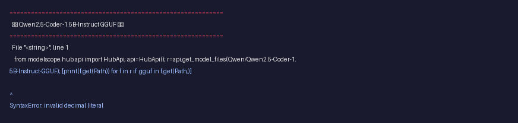
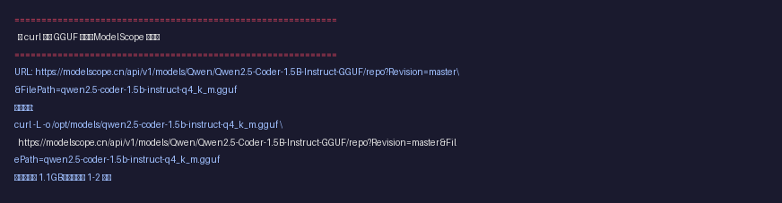
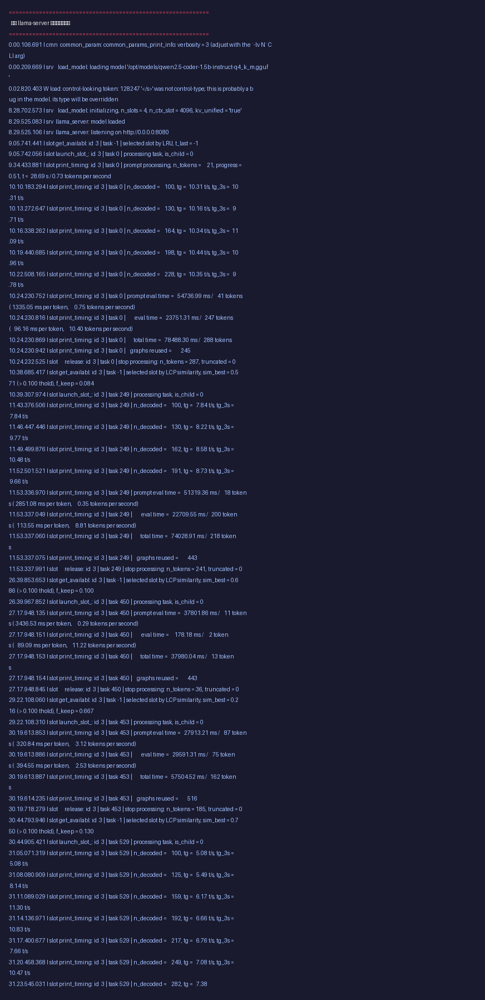

# Qwen2.5-Coder-1.5B-Instruct 纯 CPU 本地部署指南

## 前言

这份文档记录了一台**2 核 CPU、8GB 内存、无显卡**的低配机器上，从零部署 Qwen2.5-Coder-1.5B-Instruct 大模型的完整过程。

Qwen2.5-Coder 是阿里开源的代码专用大模型，1.5B 参数量的 Q4_K_M 量化版总大小约 1.1GB，在纯 CPU 环境下代码生成速度可达 **8-10 tok/s**，非常适合作为本地代码助手。

---

## 目录

1. [准备工作](#准备工作)
2. [查找并下载模型](#查找并下载模型)
3. [编译 llama.cpp](#编译-llamacpp)
4. [启动推理服务](#启动推理服务)
5. [部署聊天界面](#部署聊天界面)
6. [性能数据](#性能数据)
7. [排查命令速查](#排查命令速查)
8. [常见坑点](#常见坑点)

---

## 准备工作

### 硬件要求

| 项目 | 最低 | 推荐 |
|------|------|------|
| CPU 核心 | 2 核 | 4 核+ |
| 内存 | 8GB | 16GB+ |
| 磁盘 | 2GB 空闲 | 5GB+ |
| GPU | 不需要 | 不需要 |

**如果你机器配置更高（比如 16GB 内存、4 核以上），这份文档同样适用，而且速度会更快。**

### 建立 Swap 交换空间

> **为什么需要 Swap？**
> 8GB 内存跑 1.5B 模型非常吃紧。加载模型占用约 1.1GB，KV 缓存（上下文记忆）还需要额外内存。没有 Swap 的话，内存一满系统就会杀掉进程（OOM Killer）。Swap 就是拿硬盘当备用内存，速度慢但能保命。

```bash
# 创建 2GB 的 swap 文件
fallocate -l 2G /swapfile

# 设置权限（只能 root 读写）
chmod 600 /swapfile

# 格式化为 swap 格式
mkswap /swapfile

# 启用 swap
swapon /swapfile

# 验证 swap 已生效
swapon --show
```

看到输出里有 `/swapfile` 就说明成功了。

### 环境清单

以下工具需要提前装好：

- `python3` / `pip3`：下载模型用
- `curl`：下载文件用
- `git`：拉取代码用
- `cmake` / `g++`：编译 llama.cpp 用

```bash
# Debian/Ubuntu 一键安装
apt-get install -y build-essential cmake curl git
```

---

## 查找并下载模型

### 第一步：找到正确的模型仓库

GGUF 格式的 Qwen2.5-Coder 在 ModelScope 上的仓库地址是：

```
Qwen/Qwen2.5-Coder-1.5B-Instruct-GGUF
```

用 ModelScope 的 Python API 查询有哪些量化版本：

```bash
python3 -c '
from modelscope.hub.api import HubApi
api = HubApi()
files = api.get_model_files("Qwen/Qwen2.5-Coder-1.5B-Instruct-GGUF")
for f in files:
    if ".gguf" in f.get("Path", ""):
        print(f.get("Path"))
'
```



输出会列出所有可用的量化版本：

```
qwen2.5-coder-1.5b-instruct-q2_k.gguf       # 约 600MB，质量最差
qwen2.5-coder-1.5b-instruct-q3_k_m.gguf     # 约 750MB
qwen2.5-coder-1.5b-instruct-q4_0.gguf       # 约 850MB
qwen2.5-coder-1.5b-instruct-q4_k_m.gguf     # 约 1.1GB，推荐
qwen2.5-coder-1.5b-instruct-q5_0.gguf       # 约 1.2GB
qwen2.5-coder-1.5b-instruct-q5_k_m.gguf     # 约 1.3GB
qwen2.5-coder-1.5b-instruct-q6_k.gguf       # 约 1.5GB
qwen2.5-coder-1.5b-instruct-q8_0.gguf       # 约 1.7GB
```

### 该选哪个量化版本？

| 版本 | 大小 | 质量 | 速度 | 推荐场景 |
|------|------|------|------|----------|
| Q2_K | 600MB | 较差 | 最快 | 极少内存 |
| Q4_K_M | 1.1GB | 很好 | 快 | **首选，性价比最高** |
| Q5_K_M | 1.3GB | 最好 | 正常 | 内存充足 |
| Q8_0 | 1.7GB | 几乎无损 | 较慢 | 追求极致质量 |

我们选 **Q4_K_M**，质量和速度的最佳平衡点。

### 坑点：这几个仓库名搜不到


- `Qwen/Qwen2.5-Coder-1.5B-GGUF` — 少了 `-Instruct`，ModelScope 上没有
- `unsloth/Qwen2.5-Coder-1.5B-Instruct-GGUF` — unsloth 没传 Coder 系列

ModelScope 上只有**官方 Qwen 组织**上传的 GGUF 版，其他镜像来源没有。

### 第二步：用 curl 下载模型

> **为什么用 curl 而不是 ModelScope CLI？**
> ModelScope 的命令行工具 `modelscope download` 可以用通配符下载，但它有个坑：**文件名区分大小写**。`"*Q4_K_M*"` 匹配不到全小写的 `q4_k_m`。用 curl 直接下载单个文件更可靠。

```bash
# 确保目录存在
mkdir -p /opt/models

# 下载 Q4_K_M 量化版
curl -L -o /opt/models/qwen2.5-coder-1.5b-instruct-q4_k_m.gguf \
  "https://modelscope.cn/api/v1/models/Qwen/Qwen2.5-Coder-1.5B-Instruct-GGUF/repo?Revision=master&FilePath=qwen2.5-coder-1.5b-instruct-q4_k_m.gguf"
```



**URL 拆解说明：**

| 部分 | 含义 |
|------|------|
| `modelscope.cn/api/v1/models/` | ModelScope 的下载 API 地址 |
| `Qwen/Qwen2.5-Coder-1.5B-Instruct-GGUF` | 仓库路径（组织名/仓库名） |
| `/repo?Revision=master` | 仓库地址，指定 master 分支 |
| `&FilePath=qwen2.5-...q4_k_m.gguf` | 要下载的单个文件路径 |

文件大小约 1.1GB，下载通常需要 1-2 分钟。

### 第三步：验证下载结果

```bash
ls -lh /opt/models/
```


应该看到文件 `qwen2.5-coder-1.5b-instruct-q4_k_m.gguf`，大小约 1.1GB。

---

## 编译 llama.cpp

llama.cpp 是运行 GGUF 模型的高性能 C++ 推理引擎，专门为 CPU 优化。

### 克隆代码

> **如果 GitHub 访问很慢或连不上**，用镜像地址代替：
> `git clone https://ghfast.top/https://github.com/ggerganov/llama.cpp.git`

```bash
git clone https://github.com/ggerganov/llama.cpp.git /opt/llama.cpp
cd /opt/llama.cpp
```

### 编译（只编译服务器和客户端）

```bash
cd /opt/llama.cpp

# 用 cmake 构建
cmake -B build
cmake --build build --target llama-server llama-cli -j$(nproc)
```

编译完成后，可执行文件在：

```
/opt/llama.cpp/build/bin/llama-server   # HTTP API 服务器
/opt/llama.cpp/build/bin/llama-cli      # 命令行对话工具
```

---

## 启动推理服务

### 基本启动命令

```bash
/opt/llama.cpp/build/bin/llama-server \
  -m /opt/models/qwen2.5-coder-1.5b-instruct-q4_k_m.gguf \
  --host 0.0.0.0 \
  --port 8080 \
  -c 4096 \
  -t 2
```

**参数解释：**

| 参数 | 值 | 说明 |
|------|------|------|
| `-m` | 模型路径 | 刚刚下载的 GGUF 文件 |
| `--host` | 0.0.0.0 | 允许外部访问（如果只本机调用用 127.0.0.1） |
| `--port` | 8080 | 服务端口 |
| `-c` | 4096 | 上下文长度（一次能记忆多少内容） |
| `-t` | 2 | 使用的 CPU 线程数（核数） |

### 加载过程

服务启动后会先在内存中加载模型，1.1GB 的模型加载大约需要 **8-10 分钟**。



看到这行就说明加载完成、可以用了：

```
llama_server: listening on http://0.0.0.0:8080
```

### 验证服务可用

```bash
# 健康检查
curl http://127.0.0.1:8080/health

# 第一次推理测试
curl -s http://127.0.0.1:8080/v1/chat/completions \
  -H "Content-Type: application/json" \
  -d '{
    "model": "qwen2.5-coder",
    "messages": [{"role": "user", "content": "用Python写一个快速排序，只输出代码不要解释"}],
    "temperature": 0.7,
    "max_tokens": 300
  }'
```


> **注意：第一次调用会很慢**，因为系统需要把模型数据从磁盘读到内存缓存（冷缓存）。第二次调用就会快很多。

---

## 部署聊天界面

光有 API 用起来不方便，我们加一个网页聊天界面。

### 架构说明

```
浏览器 --HTTPS--> 聊天界面(端口3000) --代理--> llama-server(端口8080)
```

聊天界面是一个 Python 服务器，做的事情：
1. 返回 HTML 网页给浏览器
2. 把 API 请求转发给后端的 llama-server

这样浏览器和 llama-server 不会直接跨域访问，更稳定。

### 前端代码

创建 `/workspace/chat-ui/index.html`（完整代码见仓库内的 `index.html`），核心逻辑：

- 仿 ChatGPT 风格的深色聊天界面
- 自动识别并高亮代码块
- 实时显示 tok/s 生成速度
- Enter 发送，Shift+Enter 换行

### 后端代理

创建 `/workspace/chat-ui/server.py`（完整代码见仓库内的 `server.py`），核心逻辑：

- 用 Python 内置的 `http.server` 模块，零外部依赖
- `/` 返回聊天页面
- `/v1/*` 转发给 `http://127.0.0.1:8080`
- `/health` 健康检查透传

```bash
# 启动聊天界面代理（端口 3000）
python3 /workspace/chat-ui/server.py &
```

### 验证代理可用

```bash
# 检查前端页面
curl -o /dev/null -w "HTTP %{http_code}\n" http://127.0.0.1:3000/

# 测试 API 代理（应该正常返回推理结果）
curl -s -X POST http://127.0.0.1:3000/v1/chat/completions \
  -H "Content-Type: application/json" \
  -d '{"model":"qwen2.5-coder","messages":[{"role":"user","content":"say hi"}],"max_tokens":20}'
```


---

## 性能数据

### 实测环境

| 项目 | 数值 |
|------|------|
| CPU | 2 核虚拟 CPU |
| 内存 | 7.8GB |
| Swap | 2GB |
| 模型 | Qwen2.5-Coder-1.5B-Instruct Q4_K_M |
| 引擎 | llama.cpp 纯 CPU |

### 速度指标

| 场景 | 速度 |
|------|------|
| 模型加载 | 8-10 分钟 |
| 冷缓存推理 | 0.5-0.8 tok/s（prompt 处理慢） |
| 热缓存推理 | 8-10 tok/s |
| 大上下文（200+ tokens prompt） | 约 8.8 tok/s |

### 资源占用


| 资源 | 使用量 | 占比 |
|------|--------|------|
| 物理内存 | 7.5GB | 96% |
| Swap | 420MB | 21% |
| 磁盘 | 模型 1.1GB + 系统剩余 | -- |

### 查看运行进程


```bash
ps aux | grep -E "llama-server|server.py" | grep -v grep
```

---

## 排查命令速查

平时监控和排错常用的命令，收藏备用：

```bash
# 1. 看模型加载完了没
tail -f /tmp/terminal_*.log | grep "listening\|loaded"

# 2. 看内存还有多少
free -h

# 3. 看 swap 用了多少（多了说明内存不够）
swapon --show

# 4. 看磁盘还剩多少
df -h /

# 5. 看 llama-server 是否在跑
ps aux | grep llama

# 6. 看端口 8080 是否在监听
ss -tlnp | grep 8080

# 7. 测 API 是否正常
curl -s http://127.0.0.1:8080/health

# 8. 看 GPU 显存（如果有显卡的话）
nvidia-smi

# 9. 实时看 CPU 和内存使用
htop

# 10. 杀掉卡死的 llama-server
kill $(pgrep -f llama-server)
```

---

## 常见坑点

### 坑1：ModelScope 通配符区分大小写

```
# 这是错的（大写 Q4_K_M 匹配不到全小写的文件名）
modelscope download Qwen/Qwen2.5-Coder-1.5B-Instruct-GGUF --include "*Q4_K_M*"

# 这是对的
modelscope download Qwen/Qwen2.5-Coder-1.5B-Instruct-GGUF --include "*q4_k_m*"
```

**粗暴解法**：直接用 curl 下载单文件，URL 是确定的，不需要匹配。

### 坑2：仓库名里少 `-Instruct` 后缀

Qwen2.5-Coder 的 Instruct 版才是支持对话的。GGUF 仓库名必须有 `-Instruct`：

```
# 对
Qwen/Qwen2.5-Coder-1.5B-Instruct-GGUF

# 错（这个仓库不存在）
Qwen/Qwen2.5-Coder-1.5B-GGUF
```

### 坑3：第一次 API 调用特别慢

这是正常现象。模型数据还在磁盘上，第一次访问时系统才会把它加载到内存缓存（page cache）。第二次之后就从内存读了，速度明显提升。

**优化方法**：服务启动后，先跑一次简单的对话"预热"：

```bash
curl -s http://127.0.0.1:8080/v1/chat/completions \
  -H "Content-Type: application/json" \
  -d '{"model":"qwen2.5-coder","messages":[{"role":"user","content":"hi"}],"max_tokens":10}'
```

### 坑4：Swap 没有配导致 OOM

8GB 内存跑 1.5B 模型大概率要 OOM。必须提前建好 swapfile：

```bash
fallocate -l 2G /swapfile
chmod 600 /swapfile
mkswap /swapfile
swapon /swapfile
```

Swap 虽然比内存慢很多，但比进程被杀好。

### 坑5：高配机器怎么调参数

如果你机器配置高（比如 16GB+ 内存、8 核 CPU），可以这样调优：

```bash
/opt/llama.cpp/build/bin/llama-server \
  -m /opt/models/qwen2.5-coder-1.5b-instruct-q4_k_m.gguf \
  --host 0.0.0.0 \
  --port 8080 \
  -c 8192 \       # 上下文翻倍，记忆更长
  -t 8 \           # 线程数等于 CPU 核数
  -ngl 99          # 如果有显卡，把模型层放到 GPU（极快）
```

### 坑6：GitHub 克隆 llama.cpp 超时

GitHub 在国内经常连不上。用镜像站代替：

```bash
# 原版（可能超时）
git clone https://github.com/ggerganov/llama.cpp.git

# 镜像（更快更稳定）
git clone https://ghfast.top/https://github.com/ggerganov/llama.cpp.git
```

如果镜像拉下来后 `cmake` 报错，可能是 checkout 不完整：

```bash
cd /opt/llama.cpp
git checkout -f HEAD   # 强制还原到最新版本
```

---

## 附录：完整文件清单

部署完成后，工作目录应该有这些文件：

```
/opt/models/
  qwen2.5-coder-1.5b-instruct-q4_k_m.gguf    # 模型文件 (1.1GB)

/opt/llama.cpp/build/bin/
  llama-server     # HTTP API 服务
  llama-cli        # 命令行对话

/workspace/chat-ui/
  server.py        # Web 代理服务器（端口 3000）
  index.html       # 聊天界面网页
```

---

## 总结

在 2 核 8GB 的机器上成功跑通了 Qwen2.5-Coder-1.5B-Instruct Q4_K_M，代码生成速度达到 8-10 tok/s。核心要点：

1. **建好 swapfile**，8GB 内存不够用，必须借硬盘空间
2. **用 curl 直链下载** ModelScope 模型，避开 CLI 文件名匹配的坑
3. **用 llama.cpp**，纯 CPU 编译即可，不需要 CUDA
4. **第一次调用前预热**，让系统把模型缓存到内存
5. **聊天界面用 Python 代理**，零依赖，浏览器直接访问

如果机器配置更高，这份文档同样适用，而且可以把 `-t` 线程数调大，上下文 `-c` 调大，速度会明显提升。
